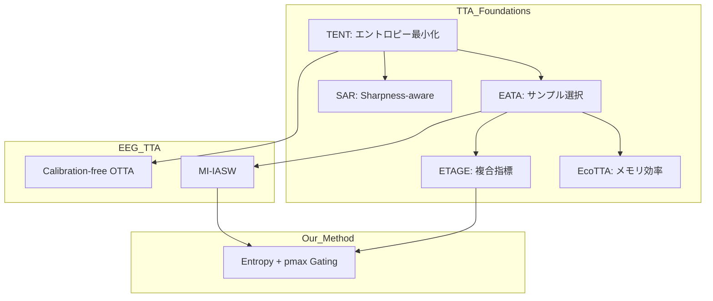

# 関連研究ライブラリ

本ディレクトリでは、Test-Time Adaptation (TTA) およびEEG-BCI分野に関連する論文を整理しています。

---

## 📁 フォルダ構造

```
related_research/
├── README.md                    # このファイル（全体概要）
│
├── tta_foundations/             # TTA基盤研究
│   ├── EATA/                    # サンプル選択 + Fisher正則化
│   ├── ETAGE/                   # Entropy + Gradient Norm + PLPD
│   ├── EcoTTA/                  # メモリ効率 + 自己蒸留
│   ├── COME/                    # Test-time Adaptation
│   └── SAR/                     # Sharpness-aware
│
├── eeg_tta/                     # EEG専用TTA研究
│   ├── MI-IASW/                 # MI-EEG専用TTA
│   ├── Calibration-free_OTTA/   # キャリブレーション不要OTTA
│   └── Continual_Finetuning/    # 継続的ファインチューニング
│
├── eeg_models/                  # EEGモデル
│   ├── TCFormer/                # ベースモデル（論文値84.79%）
│   ├── EEGMamba/                # Mambaベース
│   ├── Mamba_KAN/               # Mamba + KAN
│   └── CoordConformer/          # 座標Conformer
│
├── surveys/                     # サーベイ論文
│   └── Transformers_in_EEG/     # EEGにおけるTransformerレビュー
│
├── edge_bci/                    # エッジBCI
│   └── Low_power_EEGNet/        # Arduino向け低消費電力BCI
│
├── speech_decoding/             # 発話デコーディング
│   └── Transformer_Speech/      # Transformerベース発話デコード
│
├── depression/                  # うつ病分類
│   └── EEGNet_Optuna/           # EEGNet + Optuna最適化
│
├── uncertainty/                 # 不確実性定量化
│
└── other/                       # その他の論文
```


---

## 🔑 重要論文の概要

### TTA基盤研究

| 論文 | 主要貢献 | 我々への示唆 |
|------|---------|-----------|
| [EATA](./tta_foundations/EATA/) | サンプル選択, Fisher正則化 | pmax filteringの理論的根拠 |
| [ETAGE](./tta_foundations/ETAGE/) | Entropy + Gradient Norm | 複合ゲーティング |
| [EcoTTA](./tta_foundations/EcoTTA/) | メモリ効率, 自己蒸留 | TTTアダプター方式 |

### EEG専用TTA

| 論文 | 主要貢献 | 我々への示唆 |
|------|---------|-----------|
| [MI-IASW](./eeg_tta/MI-IASW/) | MI-EEG専用、過剰確信問題 | EEGモデルはpmax高くなりやすい |
| [Calibration-free OTTA](./eeg_tta/Calibration-free_OTTA/) | キャリブレーション不要 | BCI実用化の要件 |

### ベースモデル

| 論文 | 主要貢献 | 我々への示唆 |
|------|---------|-----------|
| [TCFormer](./eeg_models/TCFormer/) | SOTA 84.79% | ベースラインの再現 |

---

## 📊 論文間の関係



---

## 🎯 我々の研究への示唆

### 1. サンプル選択の重要性（EATA, ETAGE）
> 全サンプルでの適応は逆効果になりうる。信頼できるサンプルのみで適応すべき。

### 2. 複合指標の有効性（ETAGE）
> エントロピー単独では不十分。複数の観点からサンプルの信頼性を評価すべき。

### 3. MI-EEG固有の過剰確信問題（MI-IASW）
> MI-EEGモデルは高いpmaxを出しやすい。pmax filteringは理にかなっている。

### 4. アダプター方式の有効性（EcoTTA）
> メインネットワーク凍結＋軽量アダプター更新で効率的な適応が可能。

---

## 📝 更新履歴

- 2026-01-22: 初期構造作成、主要6論文のREADME追加
