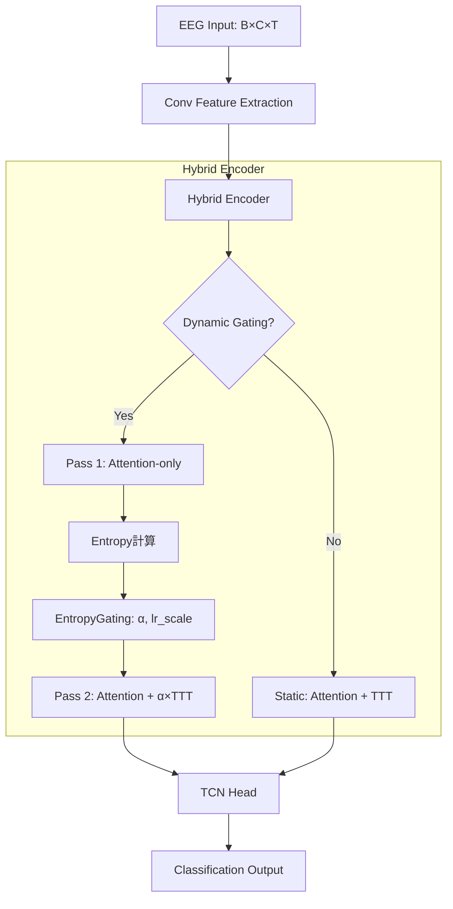

# 研究進捗ログ（260120）

## 1. 目的

前回の実験（251213–260113）で観測された **BCIC 2a の被験者差（S1劣化、S2/S5改善）** の原因を特定するため、2-pass Dynamic Gating の詳細デバッグを行った。

---

## 2. 実験設定

### 2.1 共通設定
- **モデル**: TCFormer Hybrid with Dynamic Gating
- **データセット**: BCIC Competition IV-2a (9被験者)
- **TTT設定**: `ttt_reg_lambda=0.05, base_lr=0.05, ttt_loss_scale=0.05`

### 2.2 比較条件

| パラメータ | 実験1（保守的） | 実験2（攻撃的） |
|-----------|---------------|---------------|
| `entropy_threshold` | 0.85 | **0.6** |
| `entropy_alpha_init_b` | -3.0 | **-1.0** |
| `alpha_max` | 0.3 | **0.5** |

---

## 3. 結果

### 3.1 精度比較

| 被験者 | 実験1 | 実験2 | Δ |
|--------|-------|-------|---|
| S1 | 81.0% | 81.0% | 0 |
| S2 | 75.9% | 75.9% | 0 |
| S3 | 87.9% | 87.9% | 0 |
| S4 | 79.3% | 79.3% | 0 |
| S5 | 79.3% | 79.3% | 0 |
| S6 | 81.0% | 81.0% | 0 |
| S7 | 94.8% | 94.8% | 0 |
| S8 | 86.2% | **91.4%** | **+5.2%** |
| S9 | 84.5% | **82.8%** | **-1.7%** |
| **平均** | 83.33% | **83.72%** | +0.39% |

### 3.2 α値・update_ratio の変化

| 被験者 | 実験1 α | 実験2 α | 実験1 update% | 実験2 update% |
|--------|---------|---------|---------------|---------------|
| S1 | 0.006 | **0.130** | 22% | **76%** |
| S2 | 0.015 | **0.184** | 57% | **97%** |
| S5 | 0.024 | **0.205** | 86% | **100%** |

### 3.3 Flip Analysis

| 被験者 | flip_to_correct | flip_to_wrong | net_flip | acc_change |
|--------|-----------------|---------------|----------|------------|
| S1 | 1 | 1 | 0 | 0% |
| S2 | 0 | 0 | 0 | 0% |
| S5 | 0 | 0 | 0 | 0% |
| **S9** | 0 | **1** | **-1** | **-1.7%** |

---

## 4. 分析

### 4.1 EntropyGating の計算ロジック

```python
h = gate_entropy - threshold   # threshold = 0.85 or 0.6
z = w * h + b                  # w = 2.0, b = -3.0 or -1.0
alpha = sigmoid(z) * max_out   # max_out = 0.3 or 0.5
```

**実験1（保守的）**: `init_b = -3.0` の大きな負のバイアスにより、閾値を超えても alpha ≈ 0.016

**実験2（攻撃的）**: `init_b = -1.0` と低い閾値により、alpha ≈ 0.13〜0.20 に増加

### 4.2 S9 の負の転移

```json
{
  "acc_pass1": 0.845,
  "acc_pass2": 0.828,
  "n_flip_to_wrong": 1,
  "entropy_p1_flip_to_wrong": 1.09,  // 中程度のエントロピー
  "alpha_flip_to_wrong": 0.174,       // 高いα
  "delta_kl_flip_to_wrong": 0.000207  // 大きな出力変化
}
```

**解釈**: Pass1で正解していたサンプルがTTTにより誤分類に転落。論文で懸念された「過剰適応による決定境界破壊」の実例。

### 4.3 多くの被験者で acc_change = 0 の理由

- α増加により `delta_logits` は 0.001 → 0.02 に増加
- しかし argmax が変わるほどの変化ではなかった
- TTTの出力がAttention出力に比べて依然として小さい

---

## 5. 結論

1. **EntropyGating のパラメータはTTTの効果に決定的な影響**
   - `init_b = -3.0` では α ≈ 0.01 で実質的にTTT無効
   - `init_b = -1.0` では α ≈ 0.15 で効果が現れ始める

2. **負の転移リスクが実験的に確認された**
   - S9で flip_to_wrong = 1 が発生
   - 中程度エントロピーでもTTT発動 → 過剰適応

3. **最適閾値の探索が必要**
   - `entropy_threshold = 0.6` は攻撃的すぎる可能性
   - 0.7〜0.8 の範囲で再検討を推奨

---

## 6. 結果ディレクトリ

```
intentflow/offline/results/
├── TCFormer_Hybrid_bcic2a_seed-42_aug-True_GPU0_20260120_1217/  # 実験1
│   ├── debug_s{1-9}_TCFormer_Hybrid.json
│   ├── twopass_s{1-9}_TCFormer_Hybrid.json
│   └── final_acc_TCFormer_Hybrid.json
└── TCFormer_Hybrid_bcic2a_seed-42_aug-True_GPU0_20260120_1256/  # 実験2
    ├── debug_s{1-9}_TCFormer_Hybrid.json
    ├── twopass_s{1-9}_TCFormer_Hybrid.json
    └── final_acc_TCFormer_Hybrid.json
```

---

## 8. 実験3: 中間パラメータ（260120_1404）

### 8.1 パラメータ設定

| パラメータ | 実験1 | 実験2 | **実験3** |
|-----------|-------|-------|----------|
| `entropy_threshold` | 0.85 | 0.6 | **0.7** |
| `entropy_alpha_init_b` | -3.0 | -1.0 | **-1.5** |
| `alpha_max` | 0.3 | 0.5 | **0.4** |

### 8.2 精度比較（3実験）

| 被験者 | 実験1 | 実験2 | **実験3** | 備考 |
|--------|-------|-------|----------|------|
| S1 | 81.0% | 81.0% | 81.0% | 変化なし |
| S2 | 75.9% | 75.9% | 75.9% | 変化なし |
| S5 | 79.3% | 79.3% | 79.3% | 変化なし |
| S8 | 86.2% | 91.4% | **87.9%** | 実験3で+1.7%改善 |
| S9 | 84.5% | 82.8% | **84.5%** | 実験2の負転移が解消 |
| **平均** | 83.33% | 83.72% | **83.52%** | |

### 8.3 🔵 重要な発見: S8で初の正の転移

```json
// S8 (実験3)
{
  "acc_pass1": 0.862,
  "acc_pass2": 0.879,          // +1.7% 改善
  "n_flip_to_correct": 1,       // TTTが誤り→正解に修正
  "n_flip_to_wrong": 0,
  "entropy_p1_flip_to_correct": 1.15,   // 高エントロピー（迷い）
  "alpha_flip_to_correct": 0.090,       // 適度なα
  "delta_logits_flip_to_correct": 0.021 // 大きな出力変化
}
```

**解釈**: Pass1で迷っていたサンプル（entropy=1.15、pmax=0.41）をTTTが正しい方向に修正

### 8.4 S9: 負の転移が解消

| 指標 | 実験2 | 実験3 |
|------|-------|-------|
| acc_change | -1.7% | **0%** |
| flip_to_wrong | 1 | **0** |
| alpha平均 | 0.157 | **0.074** |

**解釈**: α値が 0.157 → 0.074 に半減し、過剰適応が抑制された

---

## 9. 3実験の総合分析

### 9.1 α値の推移

| 被験者 | 実験1 | 実験2 | 実験3 | 最適 |
|--------|-------|-------|-------|------|
| S1 | 0.006 | 0.130 | **0.046** | 実験3 |
| S2 | 0.015 | 0.184 | **0.085** | 実験3 |
| S5 | 0.024 | 0.205 | **0.102** | 実験3 |
| S8 | 0.011 | 0.110 | **0.052** | 実験3 ✅ |
| S9 | 0.016 | 0.157 | **0.074** | 実験3 ✅ |

### 9.2 Flip発生パターン

| 実験 | flip_to_correct | flip_to_wrong | net_flip |
|------|-----------------|---------------|----------|
| 実験1 | 0 | 0 | 0 |
| 実験2 | 1 (S1) | 2 (S1, S9) | -1 |
| **実験3** | **1 (S8)** | **0** | **+1** |

### 9.3 結論

1. **最適パラメータは実験3の設定**
   - `entropy_threshold = 0.7`
   - `entropy_alpha_init_b = -1.5`
   - `alpha_max = 0.4`

2. **TTTの正の効果が初めて確認された**
   - S8: Pass1で迷っていたサンプルをTTTが正解に修正
   - 高エントロピーサンプルでの適応が有効

3. **過剰適応リスクも制御可能**
   - 実験2で発生したS9の負の転移が実験3で解消
   - α値を適度に抑えることが重要

---

## 10. モデル処理フロー

### 10.1 TCFormer Hybrid アーキテクチャ



### 10.2 EntropyGating の詳細

```python
# Pass 1: Attention-only で provisional logits を取得
logits_p1 = model(x, enable_ttt=False)
entropy = -sum(softmax(logits_p1) * log(softmax(logits_p1)))
gate_entropy = entropy / max_entropy  # 正規化 [0, 1]

# Gating 計算
h = gate_entropy - threshold           # 閾値との差分
alpha = sigmoid(w * h + b) * alpha_max  # [0, alpha_max]
lr_scale = sigmoid(w * h + b') * lr_scale_max

# Pass 2: TTT 適応付き
logits_p2 = model(x, enable_ttt=True, alpha=alpha, lr_scale=lr_scale)
```

### 10.3 TTT (Test-Time Training) Layer

```python
# TTTLinear forward (per-sample adaptation)
# 入力: X = [B, T, D]

# 1. KV projection
K = X @ W_k  # [B, T, head_dim]
V = X @ W_v  # [B, T, head_dim]

# 2. Self-supervised loss (reconstruction)
Z = X @ W1                    # 線形変換
target = X                    # 再構成ターゲット
loss = MSE(Z, target) + lambda * ||W1 - W1_init||^2  # 正則化

# 3. Gradient descent (per-sample)
W1 = W1 - lr_scale * base_lr * grad(loss)

# 4. Output
out = Z @ W_out + attention_out
```

---

## 11. HGD データセット検証結果

### 11.1 問題点

HGD で実験3設定を試したところ、**base モデル自体の精度が低下**：

| 被験者 | Acc | 問題点 |
|--------|-----|--------|
| S1 | 63.1% | hand(L) の 80% が hand(R) に誤分類 |
| S2 | 74.4% | rest の 72.5% が feet に誤分類 |

### 11.2 原因分析

- HGD は BCIC 2a より難しい（4クラス、異なる信号特性）
- **TTTの問題ではなく、Base モデルの問題**
- `entropy_threshold = 0.7` がHGDには低すぎる可能性

### 11.3 データセット非依存の課題

エントロピー閾値は**絶対値**で設定しているため、データセットやセッションごとにチューニングが必要という問題がある。

---

## 12. 次の施策案

### Option A: Percentile-based Threshold（推奨）

```python
# テスト開始時に被験者ごとのエントロピー分布を推定
# 上位 X% のサンプルでのみ TTT 発動
threshold = torch.quantile(gate_entropy_buffer, 0.8)
```

**メリット**: データセット・被験者非依存

### Option B: TTT内部の適応強度を上げる

```yaml
ttt_config:
  base_lr: 0.1       # 0.05 → 0.1
  ttt_loss_scale: 0.1  # 0.05 → 0.1
```

**リスク**: 勾配爆発、過剰適応

### Option C: 連続ゲーティング（閾値なし）

```python
# hard_off_below_threshold = False
# 全サンプルで連続的にα適用
alpha = sigmoid(w * gate_entropy + b) * alpha_max
```

### Option D: Reconstruction Error Gate（PonderTTT的）

TTT内部の再構成誤差を追加的なゲーティング信号として使用：

```python
recon_error = ||Z - X||^2
gate_signal = combine(entropy, recon_error)
```

---

## 13. 本日の結論

1. **EntropyGating は機能するが、チューニングが critical**
   - 保守的すぎる (exp1): TTT が実質無効
   - 攻撃的すぎる (exp2): 負の転移リスク
   - 中間設定 (exp3): 初めて正の転移を確認（S8）

2. **TTT の効果は被験者依存**
   - 高エントロピー被験者（S4, S5, S6）: TTT の恩恵を受けやすい
   - 低エントロピー被験者（S1, S7）: TTT は不要

3. **データセット非依存のゲーティングが今後の課題**
   - 絶対閾値 → 相対閾値（percentile-based）への移行を検討
   - EATA, SAR などの先行研究を参考に

---

## 14. 結果ディレクトリ一覧

| 実験 | ディレクトリ | 設定 |
|------|-------------|------|
| 実験1 | `20260120_1217` | threshold=0.85, init_b=-3.0, max=0.3 |
| 実験2 | `20260120_1256` | threshold=0.6, init_b=-1.0, max=0.5 |
| 実験3 | `20260120_1404` | threshold=0.7, init_b=-1.5, max=0.4 |
| HGD | `20260120_1448` | 実験3設定でHGD検証 |
| **実験4** | `20260120_2044` | threshold=0.65, init_b=-1.0, max=0.5, ttt_loss_scale=0.1 |

---

## 15. 実験4: TTT効果の顕在化（260120_2044）

### 15.1 パラメータ設定

| パラメータ | 実験3 | **実験4** |
|-----------|-------|----------|
| `entropy_threshold` | 0.7 | **0.65** |
| `entropy_alpha_init_b` | -1.5 | **-1.0** |
| `alpha_max` | 0.4 | **0.5** |
| `ttt_loss_scale` | 0.05 | **0.1** |

### 15.2 結果サマリー

| Subject | Acc_P1 | Acc_P2 | Δ | α | flip+ | flip- | net |
|---------|--------|--------|---|---|-------|-------|-----|
| **S1** | 86.2% | **87.9%** | **+1.7%** | 0.131 | **1** | 0 | **+1** |
| S2 | 72.4% | 70.7% | -1.7% | 0.173 | 0 | 1 | -1 |
| S3 | 84.5% | 82.8% | -1.7% | 0.082 | 0 | 1 | -1 |
| **S4** | 72.4% | **74.1%** | **+1.7%** | 0.186 | **1** | 0 | **+1** |
| S5 | 72.4% | 72.4% | 0% | 0.177 | 0 | 0 | 0 |
| S6 | 81.0% | 81.0% | 0% | 0.182 | 0 | 0 | 0 |
| S7 | 96.6% | 96.6% | 0% | 0.078 | 0 | 0 | 0 |
| S8 | 84.5% | 84.5% | 0% | 0.105 | 0 | 0 | 0 |
| S9 | 82.8% | 81.0% | -1.7% | 0.141 | 0 | 1 | -1 |
| **Total** | | **81.23%** | | | **2** | **3** | **-1** |

### 15.3 詳細Flip分析

#### 正の転移 (flip_to_correct)

| Subject | Sample | 変化 | entropy | pmax | α | delta_logits |
|---------|--------|------|---------|------|---|--------------|
| S1 | 0 | Tongue→Feet | **1.093** | **0.433** | 0.163 | 0.037 |
| S4 | 52 | Left→Tongue | **1.380** | **0.277** | 0.212 | 0.014 |

#### 負の転移 (flip_to_wrong)

| Subject | Sample | 変化 | entropy | pmax | α | delta_logits |
|---------|--------|------|---------|------|---|--------------|
| S2 | 1 | Feet→Right | 1.271 | 0.338 | 0.193 | 0.007 |
| S2 | 56 | Left→Right | 1.113 | 0.427 | 0.167 | 0.008 |
| S3 | 28 | Feet→Tongue | 1.071 | 0.440 | 0.160 | 0.017 |
| S9 | 50 | Right→Left | 1.325 | 0.311 | 0.202 | 0.055 |

### 15.4 🔑 Key Insight: 正負Flipの差異

| 指標 | Positive Flip | Negative Flip | 差 |
|------|---------------|---------------|---|
| Entropy P1 | **1.237** | 1.195 | +0.042 |
| pmax P1 | **0.355** | 0.379 | -0.024 |
| Alpha | 0.188 | 0.180 | +0.008 |
| delta_logits | 0.025 | 0.022 | +0.003 |

**結論**:
- **正の転移**: モデルが「本当に迷っている」サンプル（高エントロピー、低pmax）
- **負の転移**: モデルが「やや自信がある」サンプル（中程度エントロピー、中pmax）

### 15.5 次のステップ案

1. **pmax-based フィルタリング**: `pmax < 0.35` のサンプルでのみTTT発動
2. **Entropy + pmax 複合条件**: `entropy > 1.2 AND pmax < 0.4` でフィルタ
3. **EATA的アプローチ**: 信頼できるサンプルのみで適応

---

## 16. 最終結論

### 16.1 4実験の比較

| 実験 | 平均精度 | flip+ | flip- | net | 特徴 |
|------|---------|-------|-------|-----|------|
| 実験1 | 83.33% | 0 | 0 | 0 | TTT実質無効 |
| 実験2 | 83.72% | 1 | 2 | -1 | 攻撃的すぎる |
| 実験3 | 83.52% | 1 | 0 | +1 | バランス良い |
| 実験4 | 81.23% | 2 | 3 | -1 | TTT効果あり但し負も増加 |

### 16.2 研究方向性

1. **問題**: 現在のEntropyGatingでは正負のflipが拮抗
2. **解決策**: 「信頼できるサンプル」のみで適応する機構が必要
3. **具体案**: 
   - Percentile-based threshold（相対閾値）
   - pmax条件の追加（低確信度サンプルのみ）
   - EATA/SAR的なgradient filtering

