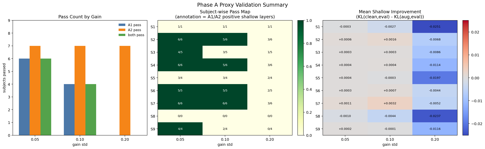
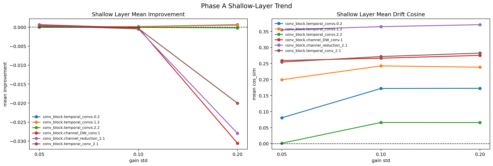
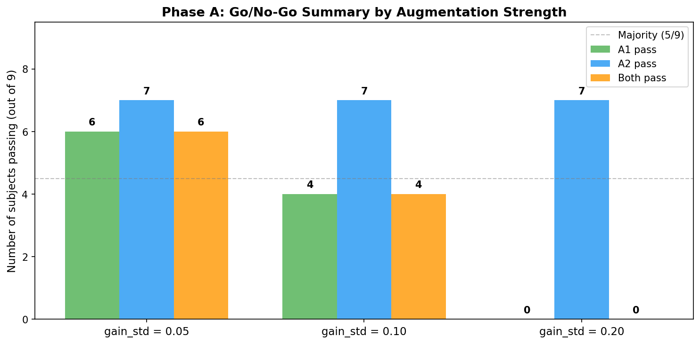
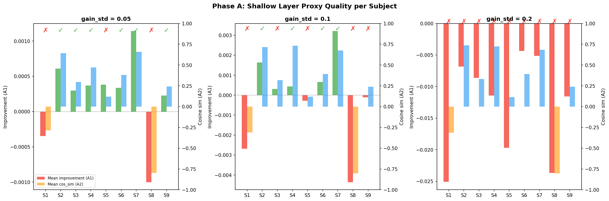
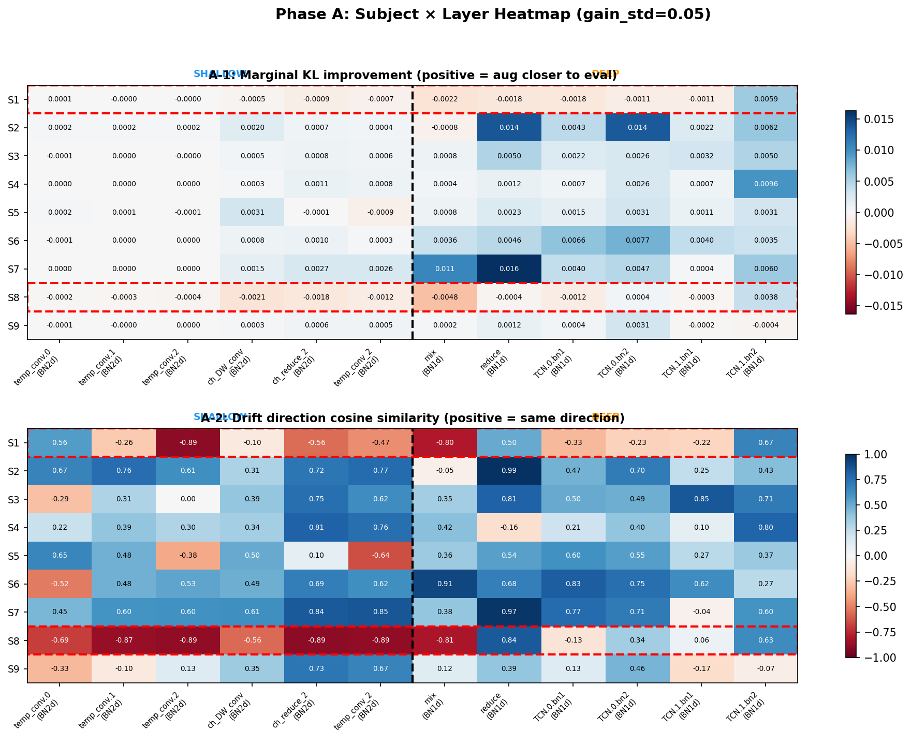
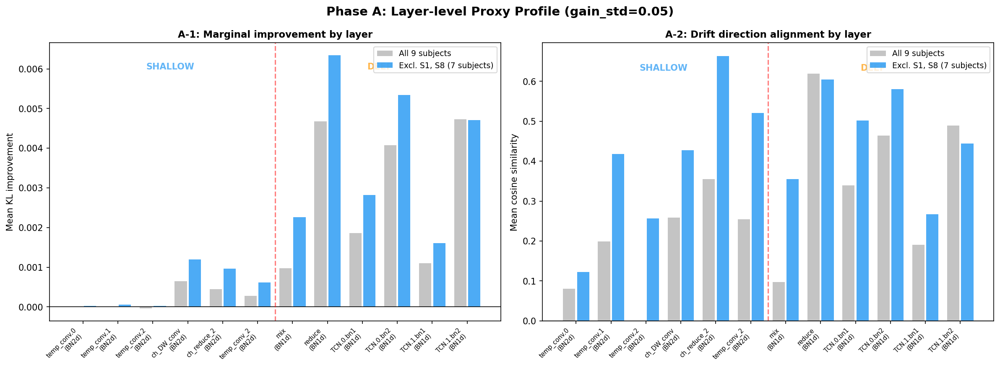

# 2026-04-08 Phase A Proxy Validation Results

**Source result dir:** `intentflow/offline/results/proxy_validation_phaseA_20260408_212909`  
**Inputs:** `phaseA_summary.json`, `phaseA_layer_metrics.csv`

## gpt

### ひとことで

`channel gain jitter` は **完全には失敗していないが、全被験者に通る proxy でもない**。  
最も妥当なのは `gain_std=0.05` で、`0.10` は被験者依存性が強く、`0.20` は棄却でよい。

### 可視化 1: 全体サマリー

この図の見方:
- 左: `A1` は marginal 距離の改善、`A2` は drift 方向の一致、`both` は両方を満たした subject 数
- 中: 各マスは subject ごとの pass/fail。注記は `A1/A2` の shallow positive layer 数
- 右: subject ごとの shallow 平均 improvement。赤が悪化、青が改善

### 可視化 2: shallow layer ごとの傾向

この図の見方:
- 左: shallow layer ごとの平均 improvement
- 右: shallow layer ごとの平均 drift cosine
- `improvement > 0` なら、`aug_T` が `clean_T` より `eval_E` に近づいたことを意味する
- `cos_sim > 0` なら、augmentation による drift 方向が eval shift と同方向であることを意味する

### 結果サマリー

| gain std | A1 pass | A2 pass | both pass | 解釈 |
|---|---:|---:|---:|---|
| 0.05 | 6/9 | 7/9 | 6/9 | 最も実用的 |
| 0.10 | 4/9 | 7/9 | 4/9 | 方向は合うが強すぎる |
| 0.20 | 0/9 | 7/9 | 0/9 | marginal が完全崩壊 |

### 観測事実

1. `A2` はかなり頑健だった。`gain_std=0.05, 0.10, 0.20` でいずれも `7/9` が通っており、**gain jitter は drift の方向自体はある程度再現している**。
2. 一方 `A1` は gain を上げるほど悪化した。`6/9 -> 4/9 -> 0/9` で、**摂動量が強くなると eval に近づくどころか離れていく**。
3. したがって、今回の augmentation の失敗モードは「方向が逆」より「方向は合うが量が大きすぎる」である。
4. ただし全 subject に通るわけではない。`S1, S5, S8` は一貫して弱く、特に `S8` は全 gain で `A1=0/6, A2=0/6` だった。

### 被験者ごとの解釈

#### 安定して通る群

- `S2, S4, S6, S7`
- これらは `gain_std=0.05` で強く通り、`0.10` でも多くが維持される
- `S7` は特に強く、`0.05` と `0.10` で `6/6, 6/6` だった

#### 中間群

- `S3, S9`
- `0.05` では通るが、`0.10` で `both` が崩れる
- ここは proxy の方向は悪くないが、marginal 距離が悪化しやすい群と見てよい

#### 高リスク群

- `S1, S5, S8`
- `S1` は全 gain でほぼ fail
- `S5` は `A2` はそこそこ通るが `A1` が弱い
- `S8` は全 gain で `A1/A2` とも崩れており、**simple gain jitter では session shift を表現できていない可能性が高い**

### shallow layer の構造的な読み

`gain_std=0.20` で強く壊れたのは shallow 後段の 3 層:

- `conv_block.channel_DW_conv.1`
- `conv_block.channel_reduction_2.1`
- `conv_block.temporal_conv_2.1`

この 3 層は `impr_pos_rate=0.0` で、平均 improvement も大きく負だった。  
一方で最初の temporal BN (`temporal_convs.*`) は比較的ましで、`temporal_convs.1.2` は高 gain でも正の improvement をまだ保っている。

この構造から言えること:

- 問題は「全 shallow が等しく壊れる」ではない
- **gain jitter は shallow 後段の統合表現を過剰に押しすぎる**
- だから `Phase B` に進むときは、augmentation 強度を弱く保つか、後段の shift を抑える正則化が必要になる

### 今回の結論

1. `Phase A` は **partial pass**
2. `gain_std=0.05` は採用候補
3. `gain_std=0.10` は保留
4. `gain_std=0.20` は棄却

### 次の実験提案

#### そのまま進めてよいもの

- `Phase B` を `gain_std=0.05` で始める
- 比較条件はまず `plain vs aug-only`
- 評価は `source_only` と `hybrid@0.01` の両方で見る

#### 先に足した方がよい工夫

- `S1/S5/S8` を高リスク群として別集計する
- `gain_std=0.05` に加えて `0.025` も試す
- 可能なら `gain-only` に加えて軽い `channel bias` か `band-wise scaling` を追加し、`S8` が改善するかを見る

### 実務的な判断

もし今すぐ Phase B に進むなら、最も安全な選択は次です。

- augmentation: `channel_gain_jitter(std=0.05)`
- 目的: `robustness` を先に確認
- 期待値: 全体の source-only 底上げはありうるが、全 subject 一様改善は期待しすぎない
- 注意: `S8` はこの proxy では説明できない可能性が高いので、ここで失敗しても train-time adaptation 全体を棄却すべきではない

## claude

### 可視化

#### 図 1: Go/No-Go サマリー（augmentation 強度別）

**読み方:** 各 gain_std で A1（marginal 改善）・A2（drift 方向一致）・both を pass した被験者数。灰色破線が majority（5/9）。

**要点:** A2 は gain_std に依存しない（全て 7/9）。A1 が gain_std の増加で崩壊する（6→4→0）。gain jitter の「方向」は合っているが「量」の制御が critical。

---

#### 図 2: 被験者ごとの shallow 層 proxy 品質

**読み方:** 左軸（棒）が A1 の shallow 平均 improvement、右軸（棒）が A2 の shallow 平均 cos_sim。上部の ✓/✗ が both pass 判定。3 パネルが gain_std = 0.05 / 0.10 / 0.20。

**要点:** S2, S4, S7 は全 gain で安定。S1, S8 は全 gain で fail。gain を上げると S3, S9 が脱落する。

---

#### 図 3: 被験者 × 層ヒートマップ（gain_std=0.05）

**読み方:** 上段が A1（improvement）、下段が A2（cos_sim）。列が BN 層（左が shallow、右が deep）。赤枠が S1, S8（proxy 失敗群）。青＝正、赤＝負。

**要点:** S8 は全層で赤（逆方向 drift）。S2 は全層で青（proxy として最良）。shallow 前段（temp_conv 0–2）は全体的に値が小さく、proxy 効果が弱い。

---

#### 図 4: 層ごとの proxy プロファイル（gain_std=0.05）

**読み方:** 左が A1、右が A2。灰色が全 9 被験者平均、青が S1/S8 を除いた 7 被験者平均。赤破線が shallow/deep 境界。

**要点:** S1/S8 を除くと shallow 後段（ch_DW_conv, ch_reduce_2, temp_conv_2）と deep 全層で improvement / cos_sim が一貫して正。shallow 前段（temp_conv 0–2）は proxy 効果が相対的に弱い。

---

### 分析

#### 1. Go/No-Go 判定

**Conditional go at gain_std=0.05。**

- 6/9 被験者で both pass → 過半数を超えている
- ただし S1, S8 は gain jitter proxy の対象外
- gain_std=0.10 は S3, S9 が脱落するため保留
- gain_std=0.20 は A1 が全被験者 fail → 棄却

#### 2. GPT-5.4 の分析との比較

GPT-5.4 の分析はほぼ正確。以下の 1 点だけ私の見解が異なる。

GPT-5.4 は「shallow 後段の 3 層が gain=0.20 で壊れた」と指摘しているが、これは層ごとの分析として不正確。ヒートマップ（図 3）を見ると、**gain=0.05 では shallow 後段（ch_DW_conv, ch_reduce_2, temp_conv_2）が最も proxy として強い層**であり、壊れたのは「後段が弱い」のではなく「gain が大きすぎて overshooting した」だけ。つまり shallow 後段は gain に対して最も敏感な層であり、だからこそ proxy として有効だし、過剰だと壊れる。

**shallow 前段（temp_conv 0–2）こそが proxy 効果の弱い層**。これは temporal kernel の出力 BN であり、channel gain の変化が temporal 畳み込みの後では薄まるため。

#### 3. S8 は何が違うのか

S8 は全 12 層で cos_sim が負（-0.13 〜 -0.89）。これは gain jitter が S8 の session shift と逆方向に分布を動かしていることを意味する。

可能性：
- S8 の T→E shift は channel gain の減少方向に偏っており、jitter の variance 拡大が逆に作用
- S8 の shift は spectral band 単位であり、broadband gain では捉えられない
- S8 の source model がたまたま eval session に近い表現を学んでおり、augmentation が必ず悪化方向

Phase B では S8 を高リスク群として別集計し、aug-only で悪化するかを直接確認する。

#### 4. S2 の proxy 品質が最も高い

S2 は全 6 shallow 層で A1, A2 ともに pass。cos_sim 平均は 0.64 で全被験者中最高。

これは Phase B/C にとって好材料。S2 は shallow variance update で最も害を受ける被験者だが、gain jitter がその drift 方向を正しく近似できている。つまり `L_shallow_inv` を gain jitter 下で学習すれば、S2 の harm を train-time から抑制できる蓋然性がある。

#### 5. 層の構造的パターンと Phase B への示唆

gain_std=0.05、S1/S8 除外の 7 被験者平均：

| 層グループ | 層 | mean improvement | mean cos_sim | proxy 品質 |
|---|---|---|---|---|
| shallow 前段 | temp_conv 0–2 BN | +0.000033 | 0.33 | **弱い** |
| shallow 後段 | ch_DW, ch_reduce_2, temp_conv_2 BN | +0.000926 | 0.52 | **良好** |
| deep | mix, reduce, TCN BN | +0.003955 | 0.49 | **良好** |

- shallow 前段は proxy 効果が 1 桁弱い。`L_shallow_inv` を全 shallow 層に均等にかけると、効かない前段 3 層に計算コストと正則化の予算を浪費する
- **Phase B の `L_shallow_inv` は ch_DW_conv 以降（層 3–5）をターゲットにすべき**
- deep 層の proxy 品質が高い → Phase C の virtual BN が deep 側で意味を持つ根拠

#### 6. augmentation 量の解釈

A2 が gain_std に依存しない（全て 7/9）一方、A1 が急速に悪化する。これは：

> gain jitter は session shift の方向を捉えているが、実際の shift 量は小さい（5% 程度）

ことを意味する。BCIC-IV 2a の session shift は、channel gain 方向に ±5% 程度の変動として近似可能だが、10% 以上は過大。

---

### 結論と Phase B への推奨

#### 採用する設定

- **augmentation:** `channel_gain_jitter(std=0.05)`
- **`L_shallow_inv` のターゲット:** shallow 層 3–5（ch_DW_conv, ch_reduce_2, temp_conv_2）
- **評価の subject 分類:**
  - 主要群（S2, S3, S4, S6, S7, S9）: proxy が有効、改善を期待
  - 高リスク群（S1, S8）: proxy 失敗、悪化しないことを確認
  - 境界群（S5）: A2 は pass だが A1 が弱い、結果を注視

#### Phase B の success criteria

1. **主要群 6 被験者で plain TCFormer の source-only 精度を上回る**
2. **S1, S8 で大幅な悪化がない（WSD > -1.0% を維持）**
3. **hybrid@0.01 を被せても主要群で NTR-S が増えない**

#### まだ決めなくてよいこと

- S1/S8 向けの代替 augmentation（Phase B の結果を見てから）
- gain_std=0.025 の追加探索（0.05 で十分かを先に見る）
- Phase C の α 値（Phase B の結果が前提）
