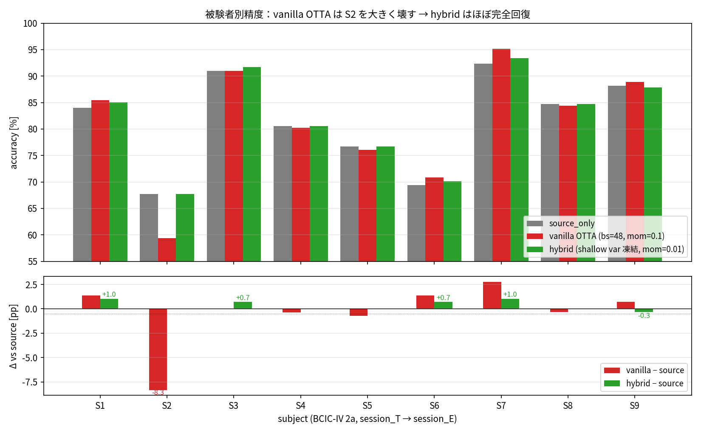
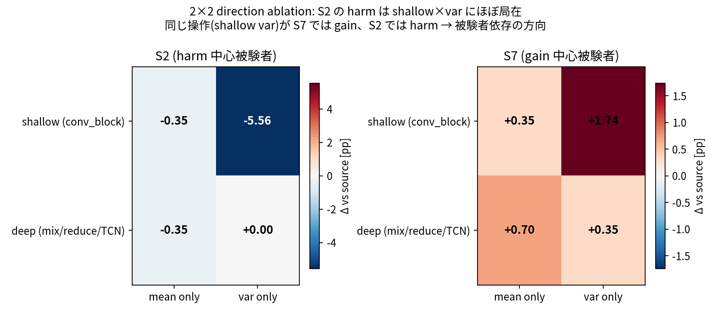
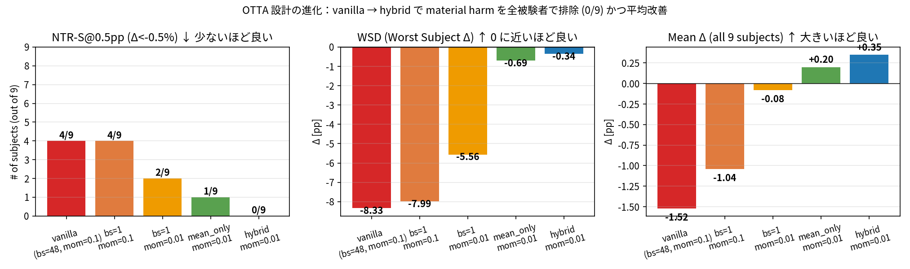
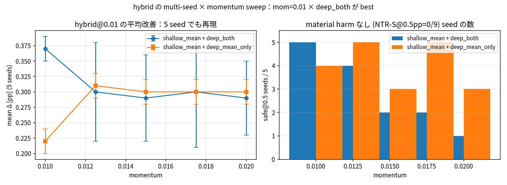
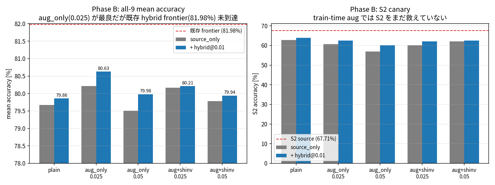
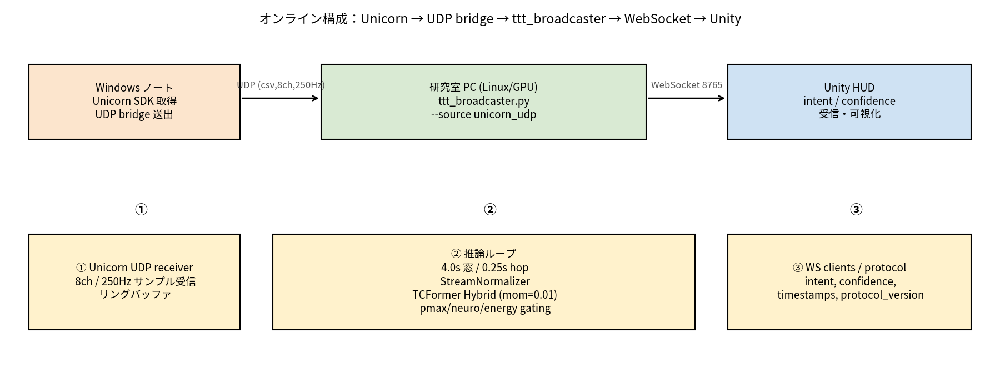

# ゼミ進捗共有 2026-04-17（M2 初回 / 2026-02 以降）

発表時間: 10–15 分

## Slide 1. 自己紹介 & 研究テーマ

- 生川 聖也 / 修士 2 年
- テーマ: **EEG 運動想起 Active BCI の cross-session 実用化**
  - 誰でも、いつでも同じモデルで動く BCI を作りたい
  - キーワード: 運動想起 (Motor Imagery) / Test-Time Adaptation (OTTA) / Online Active BCI

今日は M2 初回のゼミなので、研究の背景と目的を最初に改めて整理してから、2026-02 以降の進捗を話します。

---

## Slide 2. 研究背景：BCI と cross-session 問題

**BCI (Brain-Computer Interface):**
- 頭皮 EEG（脳波）を計測し、「右手/左手を動かすイメージ」などの意図をデコードして外部デバイス（ロボット、VR、Unity など）を制御する技術
- 非侵襲・低コストだが、EEG は SN 比が低い（信号 vs ノイズで数 μV 単位）

**運動想起 (Motor Imagery, MI):**
- 実際には動かさず、手足を動かすイメージをするだけで運動野 (C3/C4) に左右非対称な脳波変化が出る
- これを分類器に入れて「右手/左手/舌/足」などの 4 クラスを当てる — 今回の BCIC-IV 2a もこの設定

**cross-session 問題（本研究の中心課題）:**
- 同じ被験者でも、学習時のセッション (session_T) と評価時のセッション (session_E) で EEG の分布が変わる
- 装着位置・皮膚インピーダンス・眠気・ノイズ環境などで簡単に壊れる
- → 「再キャリブレーションなしで毎日使える」という実用条件への最大の障壁

**Active BCI（=利用者が能動的に操作するタイプ）の追加制約:**
- オンラインでリアルタイム (数十〜数百 ms) で動く必要がある
- 低信頼な出力は "abstain" (判断を保留) するのが安全契約（fail-closed）
- 誤検出が多いと UI として成立しない

> 📝 **補足（新 M1 向け）**: EEG = 頭皮電極で測る脳波。運動想起は「想像するだけで制御する」入力手段で、ALS など身体障害者の意思伝達にも使われる。

---

## Slide 3. 既存手法の課題：OTTA の negative transfer

**TTA / OTTA の考え方:**
- TTA (Test-Time Adaptation): test データを見ながら、その場でモデルを少しずつ調整する
- OTTA (Online TTA): 1 サンプルずつ流れてくる状況で、蓄積せずにオンライン更新する
- BN (Batch Normalization) の running stats (平均・分散) だけ更新するタイプが軽量で、BCI 向き

**問題 (Negative Transfer):**
- 既存 OTTA (TENT, EATA 等) は「予測自信 (entropy / pmax) を上げる方向」に適応する
- ところが EEG では **瞬き・筋電 (artifact) でも pmax は上がる** ことがある
- 結果: artifact で確信した誤予測 → BN がそれを「正解の統計」として学習 → モデルが壊れる
- pmax / entropy gating だけでは「正しい理由で自信がある」と「間違った理由で自信がある」を区別できない

> 📝 **補足**: 
> - **pmax** = softmax 出力の最大値。1.0 に近いほど「自信がある」予測。
> - **entropy** = 予測分布の不確実性。小さいほど自信あり。
> - **BN running stats** = 推論時に使う「平均・分散の running 値」。TTA はこれを新データで書き換える。
> - **Negative Transfer** = 適応したら元より精度が落ちる現象。TTA の最大の敵。

---

## Slide 4. 既存研究との差分

| カテゴリ | 代表手法 | サンプル選択基準 | 我々との差分 |
|---|---|---|---|
| 汎用 TTA | TENT (ICLR'21) | なし（全サンプル） | 全てで適応 = EEG では最も危険 |
| 汎用 TTA | EATA (ICML'22) | entropy + Fisher | artifact high-pmax を見逃す |
| 汎用 TTA | ETAGE (arXiv'24) | entropy + grad norm + PLPD | データ駆動のみ、脳科学制約なし |
| 汎用 TTA | SAR (ICLR'23) | sharpness-aware | 勾配更新を伴い重い |
| EEG-TTA | MI-IASW (IEEE'24) | SAL (source alignment) + MABN | 「MI は overconfident」を指摘、ただし artifact 検出はしない |
| EEG-TTA | Calibration-free OTTA (Wimpff'24) | Alignment + AdaBN + entropy min | MI-EEG の最直接先行、ただし gating は entropy ベース |

**本研究のポジション:**
- **Physics-informed (脳科学制約つき) OTTA**: ECA attention が運動野 (C3/C4) を見ているかを Neuro-Score 化し、artifact 時は適応を拒否
- **Tri-Lock Gating**: pmax × SAL × Energy の三重ロック → 「自信・アライメント・分布内性」を同時検査
- **層別 BN 制御**: どの層の何 (mean/var) を更新するかを因果同定で最小介入化 → **shallow running_var のみ凍結**
- **被験者単位の因果追跡**: 先行研究は集団平均で評価していたが、本研究は NTR-S (negative transfer rate) と WSD (worst-subject Δ) で「個別被験者を壊していないか」を追跡

> 📝 **補足**: 先行研究の多くは「平均精度が上がれば OK」の文化。Active BCI では個人で動かないと意味がないので、本研究は **被験者レベルの harm** に軸を置く。

---

## Slide 5. 研究目的（M2 の 2 本柱）

**大目的:**
> 「cross-session でも壊れない、オンラインで動く Active BCI を作る」

**2 本柱で進める:**

1. **Offline モデル研究（方法論側）**
   - OTTA が壊れる機構を被験者レベルで解明する
   - 脳科学的制約 (運動野 attention) を使った安全な適応を設計する
   - 設計目標: material harm (Δ<-0.5pp) を全被験者でゼロにしつつ平均を改善

2. **Online 実装（システム側）**
   - 実測 EEG (Unicorn ヘッドセット) → 推論 → Unity HUD まで一本のパイプラインを動かす
   - 学習時前処理と整合、低 latency、fail-closed を契約として保持
   - 実被験者で回せる土台を先に作っておく

**今日の報告内容:**
- 柱 1 = 因果同定と hybrid 設計の結果（主要成果）
- 柱 2 = pipeline 一本通ったという環境構築の共有

---

## Slide 6. 今日話すこと

1. **Offline モデル研究** — OTTA が壊れる原因を factor 単位で突き止めて、全被験者を救う設計を作った
2. **EEG → Unity のオンライン環境** — 実測 EEG (Unicorn) から Unity まで一本で動くところまで到達

---

## Slide 7. 研究の起点（2026-02 末時点の現状）

- backbone: **TCFormer** (Altaheri et al., Nature Sci. Rep. 2025)
  - Multi-kernel Conv + Transformer + TCN の hybrid、77,840 params
  - BCIC-IV 2a で SOTA 84.79% (論文値)
  - BN 12 層 = conv_block 6 (shallow) + mix/reduce/TCN 6 (deep)
- dataset: **BCIC-IV 2a**（9 被験者、4 クラス MI、288 試行 × 2 session）
- 適応: Pmax × SAL × Energy の **Tri-Lock gating** ＋ BN running stats online update

2026-03 の更新:
- Tri-Lock gating の正式実装（pmax_th + Neuro-Z conservative + Energy threshold）
- `compute_source_prototypes`・`compute_energy_threshold` を test 前に必ず計算する bug fix
- `tcformer_otta` ラッパーに `set_train_dataloader` を追加

状態: 「OTTA をかけると全体では動くが、**特定被験者 (S2) で大きく壊れる**」問題を残したまま 4 月へ。

> 📝 **補足**:
> - **SAL** = Source Alignment Level。test 特徴量が、source 学習時に作ったクラス代表ベクトルとどれだけ近いか
> - **Energy Score** = logits の分布から In-Distribution かを測る指標 (EBM 由来)
> - **Neuro-Score** = 運動野チャンネルへの attention － ノイズチャンネルへの attention

---

## Slide 8. 問題：vanilla OTTA は S2 を大破壊する



- vanilla OTTA (bn_stat_clean, bs=48, mom=0.1): **S2 で -8.33pp**、NTR-S@0.5pp = 4/9
- 平均 Δ は -1.52pp — 「平均維持」にも届いていない
- リアルタイム BCI の文脈では「特定被験者で大きく壊れる OTTA」は使えない

**問い:** S2 の害は何が原因か？ magnitude (更新量) か、direction (何を・どこで更新するか) か？

> **補足 (M1向け):**
> - **momentum**: BN 統計を動かす「学習率」的なハイパラ。`new = (1-m)·old + m·batch` で、大きいほど最新 batch に引きずられる。
> - **batch size (bs)**: 一度に平均/分散を計算するサンプル数。小さいほど batch 統計が不安定になる。
> - **NTR-S** (Negative Transfer Rate, Subject): 「source_only より 0.5pp 以上悪化した被験者の割合」。OTTA の害を数える指標。
> - **pp** = percentage point (絶対差)。accuracy が 67% → 60% なら -7pp。

---

## Slide 9. 因果同定 Step 1–2：magnitude 制御では救えない

| 条件 | S2 acc | Δ |
|---|---:|---:|
| source_only | 67.71 | ref |
| bn_stat_clean, mom=0.1, bs=48 | 59.38 | **-8.33** |
| bn_stat_clean, mom=0.1, **bs=1** | 59.72 | -7.99 |
| mom=0.1 → **mom=0.01** (bs=1) | 62.15 | -5.56 |
| mom=0.001 (bs=1) | 66.67 | -1.04 |

- bs=1 でも害は残る → batch artifact 主因説は **後退**
- momentum を下げると単調に減るが、構造的には消えない
- 最有力候補は magnitude ではなく **direction**（どの統計を・どの層で更新するか）

> **補足 (M1向け):**
> - **magnitude 系介入** = 「更新の強さ」を弱める（mom↓、bs↑）。量的介入。
> - **direction 系介入** = 「何を・どこで更新するか」を変える（mean だけ、shallow だけ、etc）。質的介入。
> - 本スライドで示したのは「量を絞っても S2 は完全には救えない」= 害は量じゃなく質に宿る、というシグナル。

---

## Slide 10. 因果同定 Step 3–4：2×2 で shallow × var が真犯人



**設定:** bn_stat_clean, mom=0.01, bs=1, S2 / S7

観測事実:
- **S2: shallow × var = -5.56% = both 全体の害と完全一致**
- mean_only, deep_* は S2 に完全無害
- S7 では shallow × var = **+1.74pp** → 同じ操作が S2 で害、S7 で益

**帰結:** S2 の harm は「浅い BN の running_var 更新」に完全に局在。  
ただし「var 更新」そのものが悪なのではなく、**被験者依存の drift 方向**が問題。

> **補足 (M1向け):**
> - **BN (Batch Normalization)**: 各 batch の mean/var で特徴量を標準化する層。学習時は batch 統計、推論時は蓄積された **running_mean / running_var** を使う。
> - **running_mean / running_var**: 学習中に `momentum` で指数移動平均される「モデルに埋め込まれた統計値」。OTTA はこれをテスト時にも更新する。
> - **shallow / deep**: TCFormer の BN 12 層を、入力側の 6 層 (shallow) と出力側の 6 層 (deep) に分けた呼称。
> - **2×2 ablation**: `{shallow, deep} × {mean, var}` の 4 組合せで、どの組合せが S2 害の原因かを同定する direction ablation。

---

## Slide 11. 設計：hybrid = shallow var だけ凍結する最小介入


**図の読み方 (上→下):**
1. EEG 窓 1 本を TCFormer に流す (BN は shallow 6 / deep 6 の計 12 層)
2. ★ が今回の最小介入 = **shallow BN の `running_var` だけ凍結**。それ以外 (shallow mean, deep mean, deep var) は momentum=0.01 で緩やかに eval 側へ更新
3. Tri-Lock gating (pmax × SAL × energy の AND) を **3 つとも通過した sample のみ** ★ の BN 更新に寄与
4. gate fail 側は **fail-closed**: BN 統計はそのまま、低信頼出力は abstain。害を連鎖させない
5. 最後に argmax で予測 emit → online なら Unity HUD へ、offline なら次 sample へ

実装（`pmax_sal_otta.py` の `_update_bn_stats`）:
- `shallow_mean_deep_both` を追加
  - shallow 6 層: running_mean のみ更新、running_var は凍結
  - deep 6 層: running_mean + running_var 両方更新
- 既存 9 モードとの互換性は保持

設計方針:
- causal finding（shallow var が犯人）に沿った **最小介入**
- mean_only のような過保守は採らない（S3/S7 の deep var gain を残す）

> **補足 (M1向け):**
> - **「凍結」** = その統計を OTTA で更新しない（学習済みの値をそのまま使い続ける）。
> - **なぜ shallow var だけ止めるのか**: 2×2 で「原因因子」と特定できたのは shallow×var のみ。deep×var は S3/S7 で益なので消したくない。原因だけを狙撃する。
> - **mean_only ベースライン**: shallow/deep 両方の mean は更新、var は全凍結。過保守で S3/S7 の gain を捨ててしまう。

---

## Slide 12. 結果：全 9 被験者で material harm ゼロ



| 指標 | vanilla | hybrid (今回) |
|---|---|---|
| NTR-S@0.5pp | 4/9 | **0/9** |
| WSD | -8.33pp | **-0.34pp** |
| Mean Δ | -1.52pp | **+0.35pp** |

- material な harm (Δ < -0.5pp) が全被験者で消えた
- かつ平均は改善側に戻した（S3, S7 の deep var gain は維持）
- S2 は 67.71% に完全回復、S3 は hybrid で **+0.70pp**（mean_only だと -0.69pp なので、deep var も必要）

> **補足 (M1向け):**
> - **NTR-S@0.5pp**: source_only より 0.5pp 以上悪化した被験者 / 全 9 被験者。分母は 9 で固定。小さいほど「誰も壊れていない」。
> - **WSD (Worst Subject Delta)**: 全被験者中で最悪の Δ。1 人でも大きく落ちれば悪い数字になる。OTTA の「最悪ケース安全性」指標。
> - **material harm**: 実用上「誤差ではなく害」と判断する閾値（本研究では 0.5pp）を超える悪化。
> - **mean Δ**: 全 9 被験者の `adapted - source_only` の単純平均。プラスなら平均改善。

---

## Slide 13. 確認：multi-seed × momentum sweep で偶然でないことを確認



- 5 seed × 5 momentum × all-9 subjects = 50 run 完走
- `shallow_mean + deep_both @ mom=0.01`: meanΔ = **+0.37 ± 0.02pp**（単 seed の +0.35 と整合）
- safe@0.5 (material harm 0) を維持できる seed = **5/5**
- 探索区間（0.01–0.02）に hidden sweet spot は無い

**現時点の offline best frontier: 81.98% mean acc (hybrid@0.01, single-seed)。**

> **補足 (M1向け):**
> - **seed**: 乱数の初期値。同じ seed なら学習結果は再現する。seed を変えて実験するのは「その結果がたまたまじゃないか」を確かめるため。
> - **sweep**: 1 つのハイパラを複数値で回す探索実験。本研究では momentum ∈ {0.005, 0.01, 0.015, 0.02, 0.025} を 5 seed で 50 run。
> - **sweet spot**: 特定のハイパラ領域でだけ性能が跳ねる小区間。無いことを確認できれば「hybrid の効果はハイパラ当たり芸じゃない」と言える。

---

## Slide 14. 次の一手：train-time robustness (Phase A → Phase B)

**動機:** test-time heuristic は飽和しつつある。学習時から `shallow invariant + deep adaptive` を作りたい。

Phase A: augmentation proxy の妥当性確認（`channel_gain_jitter`）
- A-1: marginal proximity（aug_T が eval_E に近づくか）
- A-2: drift direction consistency（aug が引き起こす BN drift が eval shift と同方向か）
- 結果: `gain_std=0.05` で 6/9 両 pass（partial pass）、S1/S8 は fail
- → mild gain jitter を試す根拠はある、ただし universal proxy ではない

> **補足 (M1向け):**
> - **train-time adaptation**: テスト時に適応する OTTA と対照的に、学習時点で「shift に強い特徴」を作り込むアプローチ。
> - **augmentation**: 学習データを人工的に変形してバリエーションを増やす（ここでは `channel_gain_jitter` = 各 EEG ch のゲインをランダムにずらす）。
> - **proxy**: 「本命の eval shift そのもの」は触れないので、安全で測れる代理指標（proxy）で aug の妥当性を事前確認する。
> - **A-1 marginal proximity**: 「aug かけた学習データ」が「テストセッション eval_E」に統計的に近づいているか。
> - **A-2 drift direction consistency**: aug が引き起こす BN 統計の動き方向が、本物の shift 方向と一致しているか。

---

## Slide 15. Phase B 結果：train-time augmentation の限界



条件: `plain`, `aug_only(0.025/0.05)`, `aug+shinv(0.025/0.05)` × `source_only` or `hybrid@0.01`

読み:
- `aug_only(0.025) + hybrid@0.01 = 80.63%`（suite 内最良、plain 比 +0.77pp）
- **既存 hybrid frontier 81.98% にはまだ 1.35pp 届かない**
- **S2 canary は全条件で plain 以下** → train-time aug だけでは causal finding を再現できていない
- `shinv` は performance booster ではなく overshoot regularizer として機能

結論: **promising だが、既存 hybrid@0.01 を置き換える段階ではない。** Phase C (virtual BN) に進む前にまだ検討事項あり。

> **補足 (M1向け):**
> - **shinv (shallow invariance loss)**: shallow BN の統計が batch 間で暴れないよう正則化する追加ロス。train-time で「shallow を安定化」する道具。
> - **canary**: 炭鉱のカナリア。S2 は vanilla OTTA で最も壊れる被験者なので、「そこが救われていなければ hybrid 効果が出ていない」という検出指標にしている。
> - **overshoot regularizer**: 「効きすぎた aug で fine-tune が行き過ぎる」のを抑える役割。単独で性能を上げるものではない。
> - **Phase C (virtual BN)**: 学習時に「仮想的な evaluation BN 統計」を混ぜて shallow を鍛えるアイデア。Phase B で S2 signal が出てから進める予定。

---

## Slide 16. Offline まとめ

**強く主張できること:**
- cross-session OTTA の失敗は BN 全体ではなく **shallow running_var の被験者依存 drift** に局在
- shallow var だけ凍結する hybrid 設計で material harm を 0/9 にしながら平均改善 (+0.35pp)
- 5 seed × momentum sweep で再現性確認済み

**未決事項:**
- S4 推論時間 47s / S9 106s の wall-time 異常（Average Response Time は 5.7ms なので pure latency ではない）
- shallow var の方向が被験者依存になる機構（特徴マップ直接観察は未実施）
- train-time で S2 を救う signal がまだ弱い

**frontier:** hybrid@0.01 (shallow_mean_deep_both), mean acc 81.98%, NTR-S@0.5pp 0/9, WSD -0.34pp.

---

## Slide 17. Online: EEG → Unity 環境構築（一旦動いた報告）



構成:
- **Windows ノート**: Unicorn SDK で EEG 取得 → UDP bridge で送出
- **研究室 PC (Linux/GPU)**: `ttt_broadcaster.py --source unicorn_udp` が UDP 受信 → リングバッファ → 推論 → WebSocket 送出
- **Unity HUD**: WebSocket 8765 で `intent / confidence / timestamps` を受信・可視化

前提は全て保持:
- 学習時前処理と整合（8ch, 250Hz, 窓 4.0s / hop 0.25s, StreamNormalizer）
- Tri-Lock gating（pmax / neuro / energy）は online でも有効
- fail-closed: 低信頼出力は abstain、gating を通らなければ BN 更新しない

---

## Slide 18. 実装状態（2026-04 時点）

実装済み:
- `intentflow/online/recorder/unicorn_udp_reader.py`
- `intentflow/online/server/ttt_broadcaster.py` に `--source unicorn_udp` 追加
- `run_unicorn_udp_live()` ループ
- `adapt_channel_count()` で入力 ch 数とモデル期待 ch 数の不一致を吸収
- `OnlineTCFormerWrapper` が TCFormer Hybrid checkpoint をロードして推論

起動コマンド:
```bash
python -m intentflow.online.server.ttt_broadcaster \
  --source unicorn_udp \
  --checkpoint <学習済み hybrid>.ckpt \
  --host 0.0.0.0 --port 8765 \
  --udp_host 0.0.0.0 --udp_port 1001 \
  --udp_packet_format csv \
  --stream_channels 8 --stream_sfreq 250 \
  --window_sec 4.0 --hop_sec 0.25 \
  --two_class_only
```

受入条件（Done の定義）を全て満たした状態:
1. `ttt_broadcaster.py` が `--source unicorn_udp` で起動
2. Unity に `intent` が継続配信（HUD 更新を確認）
3. `source prototypes unavailable` / `energy threshold unavailable` が出ない
4. `prediction_ts`, `send_ts`, `inference_ms` がログに残る

---

## Slide 19. Online まとめ

**ひとことで:** GDF 模擬パイプラインから実測 EEG ソースへの置換が完了し、Unity まで一本で通った。

**現状の制約:**
- LSL 直接受信 (`unicorn_lsl_reader.py`) は未実装 (UDP 経由のみ)
- Unicorn 専用 YAML 設定分離は未実施
- 実被験者での体感評価（latency, 信頼度の妥当性）はこれから

**次の online 側アクション候補:**
- Unicorn LSL reader 追加
- Unity 側 HUD で energy/neuro score を可視化して gating 挙動を確認
- latency / dropped-frame を継続計測するプロトコル拡張

---

## Slide 20. 今後 2 週間の方針（2026-04-17 → 2026-05-01）

**現在位置:** offline hybrid@0.01 が frontier (81.98%, NTR-S 0/9)。train-time はまだ frontier に届いていない。online は「通った」だけで実被験者評価はまだ。

**優先度の考え方:** (1) frontier を脅かす未解決 confounder を先に潰す、(2) 次の experimental branch が decisive になる条件を整える、(3) M2 として「実被験者で回した」を 1 回は手元に置く。

---

### ① S4 / S9 の wall-time 異常を切り分ける  *(Week 1 前半, 〜1 日)*

- **動機:** S4=47s / S9=106s の Test Time は Average Response Time 5.7ms と整合しない。**frontier 数値の信頼性に直結**する未決事項 (Slide 16)。
- **やること:** `hybrid_vs_meanonly_20260406_205743` のログで I/O 待ち・GC・eval loop の warm-up を切り分け、pure inference latency を再計測。
- **判定:** 他被験者と同オーダーに収まれば frontier 数値は確定。大きく残るなら原因特定まで追う。

### ② 実被験者 online pipeline 初回セッション  *(Week 1 後半, 1 セッション)*

- **動機:** 環境は動いたが「実際に被験者が付いて latency / abstain rate / Tri-Lock gating がどう出るか」は未観測。**M2 の初ゼミ以降で online 側の次タスクを決める材料がない**。
- **やること:** 自分で 15–20 分 × 左右 MI。`prediction_ts / send_ts / inference_ms / pmax / SAL / energy / abstain_count` をログ化。hybrid checkpoint 使用。
- **判定:** (a) end-to-end latency < 250ms、(b) abstain rate が妥当範囲 (10–40%)、(c) gating 3 指標の分布が offline と同じ形。外れた指標が「online 側の次の研究課題」になる。

### ③ train-time で S2 canary を初めて救う  *(Week 2 全体)*

- **動機:** Phase B 最良 (`aug_only(0.025)+hybrid@0.01` = 80.63%) でも **S2 は全条件 plain 以下** (Slide 15)。train-time で causal finding を再現できていない = この路線の本命シグナルが出ていない。
- **やること:** 現 Phase B sweep に `interaug=True` strongest recipe + `gain_jitter(std=0.025)` を追加投入。shinv は overshoot regularizer として残す。5 seed で reproducibility も同時確認。
- **判定:** S2 Δ > 0 (plain 比) が 3/5 seed 以上で出れば Phase C (virtual BN) へ進む根拠になる。出なければ train-time 路線は一旦 freeze し、subject-adaptive rule (中期タスク) を優先する。

---

**この 2 週間で終わらせないこと:** ①② は先に片付ける / ③ は走らせる、まで。 **Phase C (virtual BN) は ③ で S2 signal が出てから**。先走らない。

---

## Slide 21. 中期・長期の方針

**中期 (〜1 ヶ月)**
- `L_shallow_inv` を shallow 後段 (ch_DW_conv / ch_reduce_2 / temp_conv_2) に局所化して再試。Slide 20 ③ の結果次第で着手。
- Phase C (virtual BN): 学習時に virtual な evaluation BN 統計を混ぜて shallow を鍛える。Phase B で S2 signal が出た後のみ。

**長期**
- **Subject-adaptive rule**: session_T から「その被験者が S2 型 (shallow var 害) か S7 型 (shallow var 益)」を判別する特徴量を探索。被験者に応じて hybrid の mask を動的に切り替えたい。
- **Active BCI への統合**: online loop に OTTA hybrid を組込み、被験者参加型評価 (意図→制御→ERRP ループ) に進める。online 側でも causal-safe な適応を担保する設計に拡張。

---

## Appendix A. 使用ファイル・成果物

**設計・実験ドキュメント:**
- [260406_discussion_bn_adaptation.md](./260406_discussion_bn_adaptation.md) — 因果同定の全記録
- [260406_bn_drift_direction_ablation.md](./260406_bn_drift_direction_ablation.md) — direction ablation 詳細
- [260408_discussion_train_time_adaptation.md](./260408_discussion_train_time_adaptation.md) — train-time 設計論
- [260408_phaseA_proxy_validation_results.md](./260408_phaseA_proxy_validation_results.md) — Phase A 結果
- [260409_phaseB_train_time_plan.md](./260409_phaseB_train_time_plan.md) — Phase B 計画
- [260413_phaseB_suite_results.md](./260413_phaseB_suite_results.md) — Phase B 結果

**実験 checkpoint:**
- source model: `intentflow/offline/results/update_op_v2_20260401_125734/source_model`
- hybrid frontier: `intentflow/offline/results/hybrid_vs_meanonly_20260406_205743/hybrid/`
- 5-seed sweep: `intentflow/offline/results/hybrid_all9_fine_sweep_20260407_010039/`
- Phase B suite: `intentflow/offline/results/phaseB_suite_20260409_seed0/`

**オンライン実装:**
- [intentflow/online/recorder/unicorn_udp_reader.py](../../intentflow/online/recorder/unicorn_udp_reader.py)
- [intentflow/online/server/ttt_broadcaster.py](../../intentflow/online/server/ttt_broadcaster.py)
- [intentflow/online/models/online_wrapper.py](../../intentflow/online/models/online_wrapper.py)

**図生成スクリプト:**
- [intentflow/offline/scripts/analysis/plot_seminar_20260417.py](../../intentflow/offline/scripts/analysis/plot_seminar_20260417.py)

---

## Appendix B. 用語集 (M1向けチートシート)

**タスク・データ**
- **MI (Motor Imagery)**: 運動想起。実際には動かさず「動かすつもり」でいるだけで生じる脳波パターン。BCI で広く使われる課題。
- **BCIC-IV 2a**: 9 被験者 × 4 クラス (L/R/足/舌) × 2 セッション (T = train, E = test) の公開データセット。EEG 22ch, 250Hz。
- **session_T → session_E**: 同じ被験者の 2 日目セッション。学習は T 日、評価は E 日。日をまたぐことで **covariate shift** が生じる。
- **covariate shift**: 入力分布 p(x) が学習時とテスト時でずれること（ラベル分布 p(y) は仮定として不変）。

**モデル・学習**
- **TCFormer**: 本研究のベースモデル。Multi-kernel Conv + Transformer + TCN の組合せ (77,840 params)。BN 12 層。
- **BN (Batch Normalization)**: batch の mean/var で特徴量を標準化する層。学習時は batch 統計、推論時は running_mean/var を使う。
- **running_mean / running_var**: BN の推論時統計。学習時に momentum で指数移動平均される。OTTA で更新対象になる。
- **momentum (in BN)**: running 統計の更新率。`new = (1-m)·old + m·batch`。学習率ではなく「最新 batch にどれだけ引きずられるか」。
- **shallow / deep (BN 層)**: TCFormer の BN 12 層を入力寄り 6 層 (shallow) と出力寄り 6 層 (deep) に分けた名称。

**OTTA / TTA**
- **TTA (Test-Time Adaptation)**: 学習済みモデルをテスト時に更新して分布シフトに適応する総称。
- **OTTA (Online TTA)**: 1 sample ずつ / 小 batch ずつ逐次適応するオンライン型。BCI のリアルタイム制約と相性が良い。
- **TENT**: entropy 最小化で BN の affine (γ, β) を更新する古典的 TTA。
- **SAR / EATA / ETAGE**: sample 選択・Fisher・PLPD などを加えた代表的改良系。
- **Tri-Lock gating**: 本研究の適応ゲート。`pmax × SAL × energy` の 3 条件すべて通った sample だけが BN 更新に寄与する。

**指標・可視化**
- **pp (percentage point)**: 絶対差。68% → 62% なら -6pp。
- **Δ (delta)**: 差分。本スライドでは基本的に `adapted - source_only` (被験者ごと or 平均)。
- **NTR-S@0.5pp**: Negative Transfer Rate (Subject)。「source_only より 0.5pp 以上悪化した被験者数 / 9」。
- **WSD (Worst Subject Delta)**: 全被験者中最悪の Δ。最悪ケース安全性を見る。
- **material harm**: 実用上「誤差ではなく害」と判断する閾値（本研究では 0.5pp）を超える悪化。

**実験方法論**
- **seed**: 乱数の初期値。同じ seed → 同じ結果。seed を振って「偶然性」を排除する。
- **multi-seed sweep**: 複数 seed × 複数ハイパラを走らせる探索実験。本研究では 5 seed × 5 momentum = 50 run。
- **ablation**: 1 因子を外す / 入れ替えて影響を見る。2×2 ablation は 2 因子 × 2 水準の 4 組合せを比較する direction ablation。
- **canary**: 先に壊れる代表ケース（本研究では S2）。そこが救われていなければ手法効果は偽物と判定する。

**オンライン**
- **UDP / WebSocket**: それぞれ低レイテンシ片方向 (Unicorn → 研究室 PC) / 汎用双方向 (PC → Unity) に使っているプロトコル。
- **fail-closed**: 不確実 / 異常時は「出力しない / 更新しない」を選ぶ設計方針。BCI の安全要件。
- **abstain**: 低信頼出力時に「判断保留」を返す挙動。Tri-Lock gating が通らなければ abstain。
