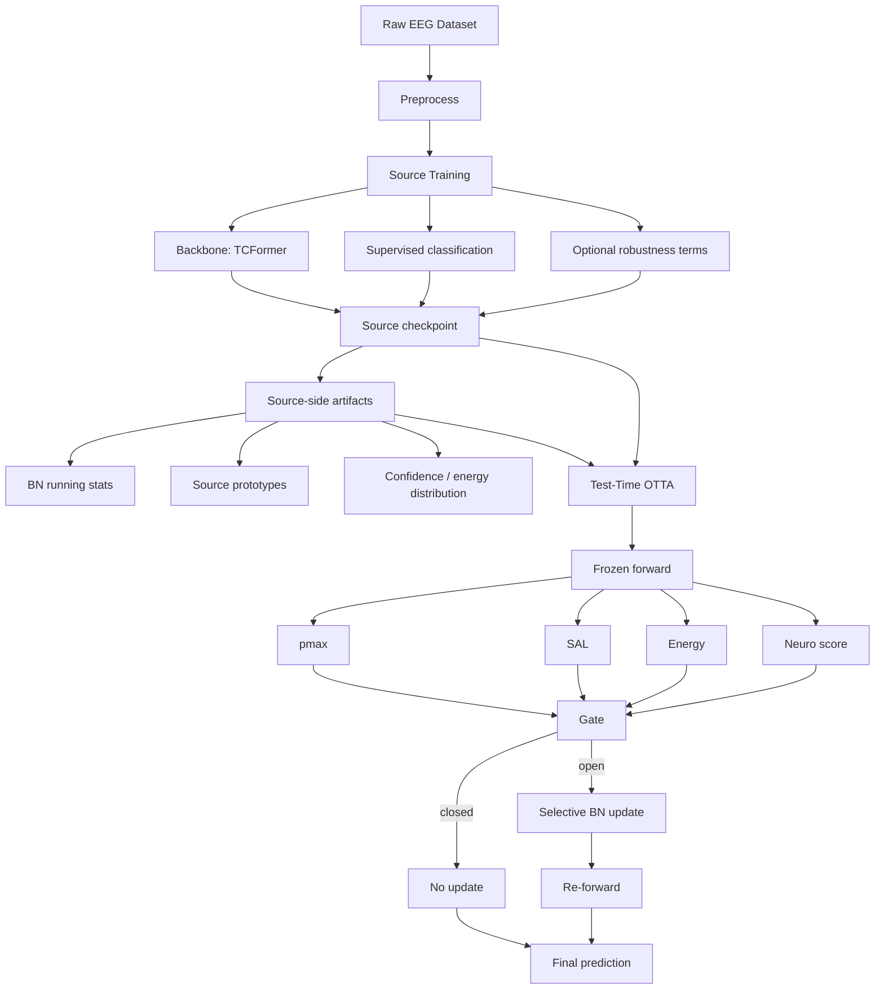

# 260422 Offline Model Design Discussion

- 目的: `offline` の次モデルを、実装前に `User / Claude / Codex` で議論して決める。
- 背景: これまでの結果から、`test-time` だけの工夫では精度改善に限界がある。次は `test-time adaptation が効きやすい source model` を、`train-time` 側も含めて設計する必要がある。
- このファイルの役割:
  - `何を守るべきか`
  - `どこを可塑的に残すべきか`
  - `どの train-time objective / augmentation を入れるべきか`
  を、実装前に論理的に詰める。

---

## 0. 前提

- 現在の strongest finding は `hybrid@0.01 (shallow_mean_deep_both)`。
- 2a の因果ストーリーとして現時点で強いのは次の 2 点。
  - 害の主因は `shallow running_var`
  - ただし subject によって `符号反転` がある
- したがって次に欲しいのは、
  - `source-only` の精度だけ高いモデル
  ではなく、
  - `test-time adaptation を安全に受けられる model`
  である。

---

## 1. いま議論したい中心問い

1. `adaptation-ready source model` をどう定義するか
2. train-time で `守る対象` は何か
3. train-time で `擬似的に起こす shift` は何か
4. test-time に残す適応は何か
5. 最初に比較すべき候補モデルを何本に絞るか

---

## 2. 現在の全体像

### 解釈

- 現状は `source training` と `test-time adaptation` がかなり分離している。
- そのため、test-time 側でどれだけ更新則を工夫しても、
  - source の特徴空間が適応を受けやすく設計されていない
  - shallow 側の統計が壊れやすい
  - hybrid gain が source 側で頭打ちになる
  という限界がある。

---

## 3. 研究の方向性

### 方向 A: `shallow を壊れにくくする`

- 発想:
  - 害の主因が `shallow running_var` なら、train-time で shallow feature / shallow stats を安定化する。
- 狙い:
  - test-time で shallow に大きな害が出にくい source model を作る。
- 候補:
  - `gain_jitter`
  - `shallow var invariance`
  - `shallow mean+logvar consistency`
- リスク:
  - 安定化しすぎると、deep も含めて全体が硬直し、`hybrid gain` が減る可能性。

### 方向 B: `deep の適応余地を残す`

- 発想:
  - shallow は守るが、deep は test-time で少し動けるようにしたい。
- 狙い:
  - `source_only` を上げるだけでなく、`hybrid - source_only` の gain を維持する。
- 候補:
  - shallow のみ強く regularize
  - deep には invariance をかけすぎない
  - deep 側の feature diversity を潰さない
- リスク:
  - shallow/deep の切り分けが曖昧だと、train-time 側の意図が崩れる。

### 方向 C: `適応を前提とした source training`

- 発想:
  - test-time に起こす更新を、train-time から見越して学習する。
- 狙い:
  - `適応を後付けする` のではなく、`適応しやすい表現` をあらかじめ作る。
- 候補:
  - 擬似 session shift 下での consistency
  - pseudo-adaptation 前後での loss 設計
  - gate で使う指標を train-time でも安定化
- リスク:
  - 一気に複雑化しやすい。
  - 今の段階でやるなら、`1軸1仮説` を守る必要がある。

---

## 4. 最初に切るべき設計軸

### 軸 1. train-time で守る対象は何か

### User
- 

### Claude
- `shallow var` を train-time で守る路線には賛成しない。理由は 3 点。
  - 「shallow var が悪い」は `TCFormer × BCIC-2a × BN × small-batch` の交絡下でしか検証していない観測事実。他 backbone や 2b で再現する保証はなく、これを train-time の中心に据えると前提が崩れたとき全部崩れる。
  - 守るべきは `低レイヤの統計量` そのものではなく、`session shift 下でも安定に残る discriminative subspace`。var に直接 regularize をかけるのは対症療法で、上位抽象の設計としては弱い。
  - train-time で守りすぎると `hybrid gain` が頭打ちになる、という Codex のリスク指摘は正しい。
- 守るべきは次の 2 点。
  - `class-discriminative subspace`（prototype / clustering structure）が session shift 下で壊れないこと
  - `deep feature の class-separability` を、shallow の gain 摂動で殺さないこと
- つまり `BN 統計` ではなく `feature geometry (prototype / margin)` を train-time invariant の基軸に置きたい。

### Codex
- 第一候補は `shallow var`。
- 理由:
  - 現在の strongest finding と最も整合する
  - `shallow mean` まで同時に強く縛ると、必要な適応まで殺す危険がある
  - 最初の仮説として最も単純

### 合意
- 方向 C を採用。train-time で守る対象は `BN 統計量` ではなく `feature geometry (class-discriminative subspace / prototype 構造)`。
- 理由: `shallow var` を直接 regularize するのは対症療法で、交絡（TCFormer × 2a × BN × small-batch）が解けていない観測事実に train-time 設計を縛るのは危険。
- 具体実装: 最終 epoch で shallow / deep class prototype を `source-side artifact` として保存する機構を追加。prototype そのものを「守る対象」とする。

---

### 軸 2. train-time で擬似的に入れる shift は何か

### User
- 

### Claude
- `gain_jitter` 単独では弱い。`channel-wise gain` は session shift のごく一部で、実測では channel 間 covariance 変化 / electrode drift / EMG 混入など複数成分が同時に動く。
- 最低 2 種類を並列に入れるべき。
  - `channel gain jitter` (既存実装の連続性確保)
  - `mixup between subjects / sessions` (subject shift の直接シミュレーション)
- 余力があれば `time-axis jitter (±50-100 ms crop)` を追加。MI onset の session ごとのズレを模す。
- ただし augmentation を増やすほど `1軸1仮説` は守れなくなるので、**最初の run は `gain_jitter + inter-subject mixup` の 2 軸固定**、それ以上は追加実験として分離する。

### Codex
- 第一候補は `channel gain jitter`。
- 理由:
  - 既存コードと連続している
  - session shift の近似として最小限
  - 実装や解釈が過度に複雑にならない
- 留保:
  - 将来的に time-axis perturbation や channel-wise noise を足す余地はあるが、初手では増やしすぎない方がよい

### 合意
- 初回は `inter-subject mixup` を主軸にする。`gain_jitter` は副次。
- 理由: 方向 C の核は「test-time で遭遇する shift を train-time で見越す」こと。`inter-subject mixup` は subject/session shift の直接的な近似であり、prototype の汎用性を train-time から育てられる。`gain_jitter` は channel レベルの摂動に留まり、prototype 設計との整合が弱い。
- `1軸1仮説` を守るため、初回 run は `inter-subject mixup` 単独固定。`gain_jitter` 追加は ablation として分離。

---

### 軸 3. test-time に残す適応は何か

### User
- 

### Claude
- `BN-stat selective adaptation` を残すという Codex 案には**反対**。現状の害の主因が `shallow running_var` にあると分かっている以上、BN を test-time で触り続ける設計は本質的に脆い。
- 提案: test-time の可塑性は **prototype の EMA 更新**に移す。
  - BN は frozen（shallow var 問題を構造的に回避）
  - source 側で保存した `shallow / deep prototype` を、Tri-Lock gate 開放時のみ EMA で更新
  - gate は shallow / deep 別々に評価（hierarchical Tri-Lock）
- この設計のメリット:
  - BN を触らないので「shallow var が壊れる」失敗モードが構造的に消える
  - BN-free なので `EEGNet / ShallowConvNet` 等の他 backbone に横断的に適用できる（新規性の横幅が広がる）
  - 既存の Tri-Lock gate 資産を壊さず、gate の適用対象だけ差し替える形になる
- 連続性は一部失われるが、`hybrid gain` という評価軸は prototype 距離に読み替え可能。

### Codex
- 現時点では `BN-stat selective adaptation` を残すべき。
- 具体的には、現 strongest である `shallow_mean_deep_both` を基準に据える。
- 理由:
  - 研究の連続性がある
  - 比較軸がぶれない
  - source model 側の変更が `hybrid gain` にどう効くかを素直に見られる

### 合意
- test-time に残す適応は **BN 統計更新ではなく prototype の EMA 更新**。
- 具体構成:
  - BN は frozen（shallow var 問題を構造的に回避）
  - Tri-Lock gate (pmax × SAL × Energy) を shallow / deep の 2 階層で別々に評価
  - gate 開放時のみ prototype を EMA 更新
- 研究連続性の担保: `hybrid gain` は `BN 更新量` ではなく `prototype 距離 / 適応前後の精度差分` に読み替える。比較軸の概念は残す。
- baseline 保護のため、既存 `shallow_mean_deep_both` の結果は参照基準として残し、新設計と並列で報告する。

---

### 軸 4. 何をもって `adaptation-ready` と呼ぶか

### User
- 

### Claude
- Codex の 4 条件（source_only 崩れない / hybrid gain 残る / worst-subject 悪化させない / safety 壊さない）に加えて、次の 2 条件を必須にしたい。
  - **backbone 横断性**: TCFormer 以外（EEGNet / ShallowConvNet）でも同じ gain を再現できる。ここが通らないと「TCFormer 固有の overfit」と批判される。
  - **dataset 横断性**: BCIC-2a の shallow var 仮説が壊れるケース（2b / ch 数や窓長が違う状況）でも、設計思想として機能する（= 大崩れしない）。
- つまり `adaptation-ready` = `特定の backbone / dataset / shift 種に依存しない適応余地設計`。単一 dataset の精度最大化とは別概念、という Codex の立て方には同意。
- 評価指標としては次の 3 軸を並列で見る。
  - `source_only acc` (絶対値 floor)
  - `hybrid gain` (適応余地の指標)
  - `cross-backbone consistency` (新規性が TCFormer 固有でないことの証明)

### Codex
- 少なくとも次の 4 条件が必要。
  - `source_only` が大きく崩れない
  - `hybrid gain` が残る
  - `worst-subject` を悪化させない
  - `safety (WSD / NTR-S)` を壊さない
- つまり `source accuracy 最大化` とは別概念として扱うべき。

### 合意
- Codex の 4 条件（source_only / hybrid gain / worst-subject / safety）を採用。
- 追加条件として **`prototype separability`** を入れる: source training 終了時点で shallow / deep prototype が各クラス間で分離していること（test-time 適応の土台）。
- `backbone / dataset 横断性` は `adaptation-ready` の必須条件には含めず、後段の **論文化時の新規性主張用の拡張評価**として位置づける（初回実験の scope 外）。
- 評価指標は `source_only acc` / `hybrid gain` / `worst-subject Δ` / `prototype class separation (silhouette 相当)` の 4 軸。

---

## 5. 候補モデル案

### 案 A. `Plain TCFormer + current OTTA`

- 位置づけ: 参照基準
- source training:
  - supervised classification のみ
- test-time:
  - current hybrid
- 役割:
  - すべての比較の baseline

### 案 B. `TCFormer + gain jitter`

- 位置づけ: 最小の adaptation-aware source training
- source training:
  - classification
  - session-shift proxy として `gain_jitter`
- test-time:
  - current hybrid
- 仮説:
  - source 側が少し shift-robust になり、hybrid の gain も維持できる

### 案 C. `TCFormer + gain jitter + shallow var invariance`

- 位置づけ: 本命候補
- source training:
  - classification
  - `gain_jitter`
  - `shallow var` を安定化する regularization
- test-time:
  - current hybrid
- 仮説:
  - shallow 側の harmful drift を抑えつつ、deep 側の適応余地を残せる

### 案 D. `TCFormer + pseudo-adaptation-aware training`

- 位置づけ: 将来候補
- source training:
  - classification に加え、test-time update を見越した objective
- test-time:
  - current hybrid or learned gate/update
- 注意:
  - 今すぐ主戦場にすると複雑すぎる可能性が高い

---

## 6. 現時点の叩き台

### User
- 

### Claude
- Codex の `案 A / B / C` はすべて **BN 更新を前提にした test-time 設計**に寄っており、shallow var 問題の根治になっていない。案を 1 本追加したい。
- **案 E: `TCFormer + inter-subject mixup + Hierarchical Prototype OTTA`** を本命に推す。
  - source training:
    - classification
    - `gain_jitter + inter-subject mixup` (軸 2 の 2 軸案)
    - 最終 epoch で `shallow / deep class prototype` を保存（source-side artifact）
  - test-time:
    - BN frozen
    - Tri-Lock gate を shallow / deep 別々に適用（hierarchical gate）
    - gate 開放時は prototype を EMA 更新（BN は触らない）
  - 仮説:
    - shallow var 問題を構造的に回避しつつ、prototype 空間で適応余地を残す
    - BN-free 設計のため、TCFormer 固有性に依存しない新規性を主張できる
- 初回比較案:
  - `案 A` (baseline) / `案 B` (最小 aug) / `案 E` (本命) の 3 本
  - `案 C` (shallow var invariance) は `案 E` で代替される（shallow を regularize するのではなく、そもそも BN を触らない方針のため）
  - `案 D` (pseudo-adaptation-aware) は `案 E` が通った後の拡張として後回し
- 新規性の主張ポイント（論文書く時の核）:
  - `BN-free prototype-based OTTA for EEG MI` は 2025-2026 の文献に見当たらない
  - `hierarchical (shallow + deep) Tri-Lock gate` も未見
  - 両者を組み合わせた joint source-training + test-time design が新規

### Codex
- 現時点の第一候補は `案 C`。
- 理由:
  - 既存因果ストーリーと整合
  - `test-time だけでは限界がある` という問題意識に直接応える
  - それでもなお、`current hybrid` を固定して比較できる
- ただし初回比較は `A / B / C` の 3 本で十分。
- `D` は今すぐ本命にしない方がよい。

### 合意
- 本命は **方向 C を最小構成で具体化した `案 E': Hierarchical Prototype OTTA (minimal)`**。
- 構成:
  - source training:
    - 普通の classification
    - `inter-subject mixup` (pseudo session shift の最小近似)
    - 最終 epoch で shallow / deep class prototype を `source-side artifact` として保存
  - test-time:
    - BN frozen
    - Tri-Lock gate を shallow / deep 別々に評価（hierarchical）
    - gate 開放時のみ prototype を EMA 更新（BN は触らない）
- 主軸: 「test-time は prototype を動かす」前提で、source が prototype を整えて渡す **joint source-training + test-time design**。
- 初回比較 3 本:
  - `案 A` (plain TCFormer + 現 hybrid) — baseline
  - `案 B` (TCFormer + inter-subject mixup + 現 hybrid) — aug のみの効果切り分け
  - `案 E'` (本命) — prototype joint design の効果
- 後回し:
  - `案 C` (shallow var invariance) は `案 E'` で代替される（BN を触らない方針のため regularize 不要）
  - `案 D` (明示的 pseudo-adaptation loss) は `案 E'` の拡張として分離
  - `gain_jitter` 追加、`backbone 横断 (EEGNet / ShallowConvNet)` は後段 ablation
- 注意: `1軸1仮説` を守るため、初回 run では mixup 以外の aug を足さない。hierarchical gate の shallow/deep 別閾値も初回は同一値で固定し、ablation で分離する。

---

## 7. Claude に聞きたい論点

1. `shallow var invariance` を train-time の主軸に置くことに賛成か
2. `gain_jitter` を最初の shift proxy にするのは十分か
3. `adaptation-ready` の定義に、`hybrid gain` を必須で入れるべきか
4. 最初の候補を `A / B / C` に絞ることに異論があるか
5. `pseudo-adaptation-aware training` は今段階では早すぎるか

### Claude の回答
1. **反対**。shallow var に直接 regularize をかけるのは対症療法で、交絡が解けていない観測事実に train-time 設計を縛りつけるのは危険。守るべきは `feature geometry (prototype / class-discriminative subspace)`。
2. **不十分**。session shift は channel gain だけでは近似しきれない。最小でも `gain_jitter + inter-subject mixup` の 2 軸を入れるべき。
3. **必須で入れるべき**。ただし `hybrid gain` を BN 更新量で定義するのではなく、`adaptation 前後の prototype 距離 / 精度差分` に読み替える。BN frozen を前提にしても gain の概念は残せる。
4. **異論あり**。A / B / C はすべて BN 更新前提で、shallow var 問題の根治になっていない。`案 E: Hierarchical Prototype OTTA` (BN-free + prototype EMA + hierarchical gate) を本命に入れ替え、初回比較は `A / B / E` にしたい。
5. **早すぎる**。ただし「適応しやすい表現を train-time から作る」という思想自体は案 E に内在している（prototype 収集機構が source-side artifact として組み込まれる）。明示的な pseudo-adaptation loss は、案 E が通った後の拡張として分離する。

---

## 8. 決定ログ

### 2026-04-22
- ファイル作成
- まずは `モデル設計の議論` に専念し、ここでは実装手順は書かない

### 2026-04-22 (追記)
- 方向 C (`適応を前提とした source training`) を採用。
- 本命モデル = `案 E': Hierarchical Prototype OTTA (minimal)`。
  - train-time で守る対象: `prototype 構造 (feature geometry)`
  - pseudo shift: `inter-subject mixup` (単軸固定)
  - test-time: BN frozen + shallow/deep 別 Tri-Lock gate + prototype EMA 更新
- 初回比較 3 本: `A (plain)` / `B (+mixup のみ)` / `E' (本命)`。
- `案 C (shallow var invariance)` は採用しない（BN を触らない方針により不要）。
- `案 D (明示 pseudo-adaptation loss)` と `backbone / dataset 横断性検証` は後段拡張として分離。
- 次段階: 実装計画を別ファイル (`260422_next_implementation_plan.md` 系) で詰める。本ファイルはここまでで議論を締める。

### 2026-04-22 (再追記) — 先行研究精読後の 案 E' → 案 E'' refinement

#### 精読対象
- `MI-IASW` (Peng+ IJCNN 2025) / `BTTA-DG` (Luo+ ICLR 2026) / `T-TIME` (Li+ 2024) / `BFT` (Wimpff+/Li+ 2026) / `T3A` (NeurIPS 2021) / `SAR` (ICLR 2023)
- 詳細差分: `260422_precedent_differentiation.md`

#### refinement 4 点
1. **EA (Euclidean Alignment) 前処理を必須化**
   - T-TIME / BFT / BTTA-DG で全て前処理デフォルト。案 E' では未明示だったため skip するとベースライン側が構造的に弱くなる。
   - source 学習と test-time 両方で subject-level EA を既存 z-score の**前段**に挿入する。
2. **Source prototype 構築を augmentation forward 集約型に変更**
   - T3A が EEG MI で失敗（T-TIME 報告: 68.23% < source 73.52%）した主因は "高次元単一平均 prototype" の脆弱性。
   - 最終 epoch で `N 回の augmentation forward × class 平均` で robust prototype を作る（BFT の transformation aggregation 思想を source 側に流用）。
3. **Shallow prototype は "初回採用" ではなく "ablation 軸" に降格**
   - Deep research 批判「shallow は nuisance 蓄積する」 + MI-IASW ablation（source-guided weighting 単体は弱く、強力コンポーネントは BN 適応側）を受けて、初回は **E''-deep-only** を主軸にする。
   - Shallow 追加は `E''-dual` として純 gain を測る ablation。
4. **新規性ステートメントを再定式化**
   - 旧: 「EEG MI での prototype TTA」→ **MI-IASW / T3A / 源氏プロトタイプ系と曖昧に重なる**。
   - 新: 「**BN を持つ EEG MI backbone (TCFormer) に対する、BN 完全凍結 + 深度別 prototype gated EMA の forward-only OTTA**」
   - 独立主張 4 軸: (i) BN 完全凍結、(ii) shallow+deep hierarchy、(iii) per-depth Tri-Lock、(iv) forward-only + prototype EMA。これら 4 つは先行と個別にも重ならないが、**4 軸の同時搭載**が主張の核。

#### 初回比較の確定
- `案 A` (hybrid@0.01, BN-only, 既存ベスト) — baseline 1
- `案 B` (vanilla-both, BN full) — baseline 2 (BN 更新の上限)
- **`案 E''-deep-only`** (BN frozen + deep prototype EMA + Tri-Lock) — 本命
- (optional) `案 E''-dual` (+ shallow prototype) — ablation

#### 先行研究から借用する負のエビデンス
- **BN-凍結の動機**: SAR "BN is crucial factor hindering TTA stability" + BTTA-DG "noisy trials → BN overwrite → catastrophic forgetting" + 我々の 260406 S2 実験 → **独立 3 ソース**で補強
- **単層 prototype の限界**: T3A (CV→EEG 失敗) + MI-IASW ablation (CAW+SAL 単体は弱い) → **hierarchical 化**の必然性

#### 残リスク (実装着手前に継続監視)
- MI-IASW 後続論文 (Peng/Li/Luo/Wang group) で "BN-frozen prototype EMA" が 2026 後半に出る可能性 → arxiv + IJCNN 2026 を月次 check
- Decoupled Prototype Learning 系 (arXiv:2401.08703) の EEG 適用 → 1 本 spot check 予定

#### 次段階
- 実装計画は `260422_next_implementation_plan.md` 系で別途詰める。本ファイルは 案 E'' 確定まで。

