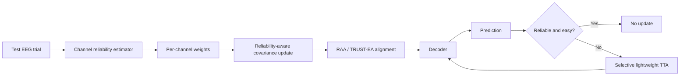
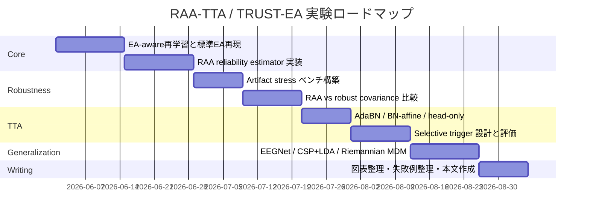

# seiyanaru intentflow と RAA-TTA TRUST-EA の精査報告

## エグゼクティブサマリー

結論から言う。**RAA-TTA / TRUST-EA の新規性は「条件付きで立つ」が、立つ場所はかなり狭い。** 既存研究はすでに、EA そのもの、Riemannian 系 alignment、online EEG test-time adaptation、alignment と BN 更新の併用、channel attention、bad-channel 検出、artifact rejection、壊れた EEG への頑健化まで相当押さえている。したがって、「alignment に使う共分散を、test-time の per-channel reliability で重み付けする」「その reliability を TTA 発火条件にも使う」という**一点突破**で差を作れなければ、既存の焼き直しに見える。逆にそこを、**bad-channel / artifact stress 下で standard EA より壊れにくい**という形で明確に実証できれば、少なくとも workshop 級は十分狙える。平均精度の微増だけでは弱い。citeturn40view1turn57view0turn39view0turn39view1turn56view0turn60view0turn59view1turn59view0

**一番強い論文ストーリー**は、「standard EA は bad channel 混入時に alignment 用共分散が壊れる。RAA はそこを reliability-aware に守る。その結果、clean 条件では極端に損せず、artifact 条件では degradation slope を下げ、さらに selective TTA の harm を減らす」である。これは、単なる平均精度向上や decoder-agnostic 主張より強い。decoder-agnostic はすでに EA 自体の長所であり、2025 年には EA と BN 統計更新と自己教師あり更新を複数 decoder に差し込む “dual-stage alignment” 系まで出ている。citeturn40view1turn56view0turn39view1

一方、**seiyanaru/intentflow の repo については、このセッションでは README・ライセンス・コミット履歴・issue・主要ファイル本文を取得できず、厳密な中身監査はできていない。** 公開 web で “IntentFlow” として強くヒットしたのは、2025 年の LLM ライティング支援系 HCI 論文であり、EEG-BCI 研究と直結する証拠は確認できなかった。また、ユーザー提示の研究計画本文にも intentflow が研究本線として登場していない。したがって現時点では、**研究本線との関連性は未立証**であり、運用上の推奨は「研究本線からは除外し、即削除ではなく archive 保管」が妥当だ。完全削除は、未確認の依存・未公開実験コード・再現性資産を巻き込むリスクがある。citeturn4academia0 fileciteturn0file0

## intentflow リポジトリ監査

### 取得範囲と限界

このセッションでは、GitHub 上の `seiyanaru/intentflow` について、**README、license、file tree、major files、commit history、issues の実体を取得できなかった。** したがって、依頼された「ファイル別の用途・重複度」監査を、根拠付きで埋めることはできない。ここでファイル名や依存関係を推測で書くのは不正確なのでやらない。公開 web 側で “IntentFlow” に関して確認できた高信頼ソースは、LLM ライティング支援システムの研究論文であり、EEG/BCI 実験基盤であることを示す材料にはならなかった。citeturn4academia0

### 暫定判断

厳密監査ができない以上、削除判断は**条件付き**にしか出せない。だが、現時点の証拠では、ユーザーが提示した研究本線は EEG-MI / EA / TTA / domain alignment であり、`intentflow` がその本線の必須資産だという証拠はない。したがって、**「本線 repo ではない」前提なら、研究用ワーキングセットから外して archive に回す**のが合理的だ。即時完全削除は、未確認のスクリプト・メモ・再現ログ・古い実験設定を失うリスクがある。逆に archive 保管なら、認知的ノイズは減らせるが、消失リスクはほぼゼロにできる。fileciteturn0file0

| 監査項目 | 現時点の状態 | 研究上の意味 | 暫定判断 |
|---|---|---|---|
| README | 未取得 | 目的不明のため、必要性判定不能 | 削除判断保留、archive 推奨 |
| License | 未取得 | 外部公開/再利用時の法的リスク未評価 | 即削除より保管が安全 |
| Commit history | 未取得 | 継続運用中か、放棄済みか不明 | 活動証拠がなければ本線除外 |
| Issues / PR | 未取得 | 未解決タスクや TODO の有無不明 | 完全削除は危険 |
| Major files | 未取得 | 実験資産か単なる試作か不明 | ファイル単位の冗長性評価不能 |
| Dependencies | 未取得 | 他 repo / notebook からの暗黙依存不明 | 先に archive、後で削除判定 |

### 実務上の推奨

**推奨は「retain ではなく archive」だ。**  
“残すか消すか” の二択ではなく、次の三層に分けるべきだ。

- **研究本線に必要**: 残す  
- **不要だが将来の参照価値あり**: archive  
- **検証済みで完全不要**: 削除  

`intentflow` は、現時点では二番目に置くのが妥当だ。理由は単純で、**必要性の証拠がない**一方、**不要性の証拠もまだない**からだ。研究本線 repo から外して一覧性を上げる、ただし削除はしない。この判断が、コスト最小・後悔最小である。citeturn4academia0 fileciteturn0file0

## 近接先行と Q1-Q6 の評価

### 近接先行の要点

まず、EA と Riemannian 系 alignment は新しくない。He & Wu の EA は、target subject の decoding を改善しうる低コスト・unsupervised alignment として確立しており、その後の総説でも多数の BCI paradigm で有効性と拡張が整理されている。Riemannian 側も、MEKT のように covariance を manifold 上で合わせて tangent space 適応まで行う系統がすでにある。さらに 2024–2026 の流れでは、EA と deep learning の体系評価、heterogeneous channels への physics-informed Riemannian adaptation、electrode/session 差を扱う graph/domain adaptation が揃っている。つまり、**alignment そのものは既存土俵**だ。citeturn40view1turn38view0turn70view0turn57view0turn69view0turn62view0

次に、**EEG の online / test-time adaptation も新しくない。** Wimpff らは 2023 年に MI decoding に対して OTTA を導入し、alignment・adaptive BN・entropy minimization を比較している。T-TIME は online unlabeled stream を前提に、aligned source から ensemble を初期化し、conditional entropy minimization と adaptive marginal regularization で更新する。BFT は backpropagation を使わない lightweight TTA を EEG に持ち込み、resource-constrained BCI を前面に出している。さらに 2025 年の dual-stage adaptation は、**EA + BN 統計更新 + self-supervised decoder update** を、複数 dataset・複数 decoder に跨って plug-in 的に主張している。したがって、**RAA が単に「EA の後に AdaBN / BN update / self-supervision」を付けるだけなら埋没する。** citeturn39view0turn39view1turn40view0turn56view0

最後に、**bad-channel / corruption / channel weighting も別系統でかなり埋まっている。** DSF は、欠損・汚染 EEG に対して good channel に注意を向け bad channel を無視する plug-in module で、強い corruption 下では最大 29.4% accuracy 改善を報告している。channel attention 系も、MI decoding における channel importance を系統的に比較している。2025 年には blink propagation を使った bad EEG channel detection まで現れ、MI を含む BCI で channel removal による大きな改善を示している。つまり reviewer は、**RAA を「alignment 版の channel weighting / bad-channel handling」だと見る**。そこから逃げるには、分類性能ではなく**alignment 用共分散推定を守るための reliability weighting**であることを、数式だけでなく実験で切り分ける必要がある。citeturn60view0turn61view0turn61view1turn59view1

### 近接先行論文一覧

| 論文 | 著者 | 年 | arXiv / DOI | タスク | 手法 | Reported gain | コード |
|---|---|---:|---|---|---|---|---|
| *Transfer Learning for Brain-Computer Interfaces: A Euclidean Space Data Alignment Approach* | He He, Dongrui Wu | 2019 | arXiv:1808.05464 | cross-subject EEG TL | Euclidean Alignment | offline / simulated online で Riemannian DA と no-alignment を上回る citeturn40view1 | 未確認 |
| *Revisiting Euclidean Alignment for Transfer Learning in EEG-Based Brain-Computer Interfaces* | Dongrui Wu | 2025 | arXiv:2502.09203, JNE DOI 10.1088/1741-2552/addd49 | EA 総説 | EA の正しい使い方・応用・拡張整理 | 13 paradigm で有効性整理 citeturn38view0 | 未確認 |
| *Manifold Embedded Knowledge Transfer for Brain-Computer Interfaces* | Wen Zhang, Dongrui Wu | 2020 | arXiv:1910.05878 | offline unsupervised cross-subject EEG | manifold alignment + tangent space DA | 複数 SoTA を上回り、DTE で計算コスト半減超 citeturn70view0 | 未確認 |
| *Calibration-free online test-time adaptation for electroencephalography motor imagery decoding* | Martin Wimpff, Mario Döbler, Bin Yang | 2024 | arXiv:2311.18520 | online MI OTTA | alignment + AdaBN + entropy minimization 比較 | SOTA 結果と主張、数値は abstract 未記載 citeturn39view0 | 未確認 |
| *T-TIME: Test-Time Information Maximization Ensemble for Plug-and-Play BCIs* | Siyang Li et al. | 2024 | arXiv:2412.07228, TBME DOI 10.1109/TBME.2023.3303289 | online unlabeled EEG stream | aligned source ensemble + entropy minimization + adaptive marginal regularization | 約 20 の classical / SoTA TL を上回る citeturn39view1 | あり（abstract 記載） citeturn39view1 |
| *Backpropagation-Free Test-Time Adaptation for Lightweight EEG-Based Brain-Computer Interfaces* | Siyang Li et al. | 2026 | arXiv:2601.07556 | EEG TTA | backprop-free transformation ensemble | 多 dataset で有効、数値は abstract 未記載 citeturn40view0 | 未確認 |
| *Online Adaptation via Dual-Stage Alignment and Self-Supervision for Fast-Calibration Brain-Computer Interfaces* | Sheng-Bin Duan et al. | 2025 | arXiv:2509.19403 | online calibration-free BCI | EA + BN stats update + self-supervised decoder update | MI で平均 +3.6%、SSVEP で +4.9% citeturn56view0 | 未確認 |
| *A Systematic Evaluation of Euclidean Alignment with Deep Learning for EEG Decoding* | Bruna Junqueira et al. | 2024 | arXiv:2401.10746 | EA + DL | shared model / ensemble の体系評価 | target subject で +4.33%、収束時間 70%超短縮 citeturn57view0 | 未確認 |
| *Robust learning from corrupted EEG with dynamic spatial filtering* | Hubert Banville et al. | 2021 | arXiv:2105.12916 | corrupted / missing channel EEG | dynamic spatial filtering | 強い corruption で最大 +29.4% accuracy citeturn60view0 | 未確認 |
| *EEG motor imagery decoding: A framework for comparative analysis with channel attention mechanisms* | Martin Wimpff et al. | 2024 | arXiv:2310.11198 | MI EEG | channel attention 比較フレームワーク | attention が軽量条件で有効と報告、数値は abstract 未記載 citeturn61view0 | 未確認 |
| *A channel attention based MLP-Mixer network for motor imagery decoding with EEG* | Yanbin He et al. | 2021 | arXiv:2110.10939 | MI EEG | channel attention for discrimination | compared algorithms を上回ると報告 citeturn61view1 | 未確認 |
| *Automatic Blink-based Bad EEG channels Detection for BCI Applications* | Eva Guttmann-Flury et al. | 2025 | arXiv:2507.17405 | bad-channel detection in BCI | blink-pattern-based bad channel detection + removal | 93.81% vs ICA 79.29% / ASR 84.05% citeturn59view1 | 未確認 |
| *From EEG Cleaning to Decoding: The Role of Artifact Rejection in MI-based BCIs* | Davoud Hajhassani et al. | 2026 | arXiv:2605.12408 | MI artifact rejection | lightweight adaptive rejection via SQI | 低 SNR 条件で効果大、inter-subject variability 低減 citeturn59view0 | 未確認 |
| *Physics-informed and Unsupervised Riemannian Domain Adaptation for Machine Learning on Heterogeneous EEG Datasets* | Apolline Mellot et al. | 2024 | arXiv:2403.15415 | heterogeneous channels / cross-dataset EEG | field interpolation + Riemannian DA | shared channels が少ない時に一貫して優位 citeturn69view0 | 未確認 |
| *BDAN: Mitigating Temporal Difference Across Electrodes in Cross-Subject Motor Imagery Classification via Generative Bridging Domain* | Zhige Chen et al. | 2024 | arXiv:2404.10494 | cross-subject MI | electrode-aware bridging DA | superior performance と報告、数値は abstract 未記載 citeturn62view0 | 未確認 |
| *EEG-DG: A Multi-Source Domain Generalization Framework for Motor Imagery EEG Classification* | Xiao-Cong Zhong et al. | 2023 | arXiv:2311.05415 | unseen target MI | multi-source DG | 2a 81.79% / κ 0.7572、2b 87.12% / κ 0.7424 citeturn22academia2 | あり（abstract 記載） citeturn22academia2 |

### Q1 から Q6 への直接回答

| 問い | 判定 | 回答 |
|---|---|---|
| Q1 新規性 | **部分的に Yes** | **EEG-MI / cross-session / cross-subject / online TTA / EA or Riemannian alignment / channel reliability / bad-channel robustness / selective update** という部品群は既存に存在する。ただし、**test-time の per-channel reliability で EA/RA の共分散推定自体を重み付けする**というド直球の組み合わせは、今回調べた範囲では確認できなかった。citeturn39view0turn39view1turn56view0turn60view0turn59view1turn69view0 |
| Q2 近接先行との被り | **大きい** | EA、Riemannian alignment、online TTA、channel attention、bad-channel detection、artifact rejection、heterogeneous-channel DA は全部近い。被りは広いが、**alignment covariance を reliability-aware に変える点**だけが空いている。citeturn40view1turn70view0turn39view0turn39view1turn56view0turn60view0turn61view0turn59view1 |
| Q3 channel selection との差別化 | **成立するが、実証が必要** | 「分類に重要な電極」ではなく「alignment を壊さない電極」を重視する、という理屈は通る。ただし reviewer は高確率で “channel weighting disguised as attention/selection” と言う。**alignment-only 作用**をアブレーションで切り分けない限り、差別化は成立しない。citeturn61view0turn61view1turn60view0turn59view1 |
| Q4 robust covariance との差別化 | **成立余地あり** | Tyler M、shrinkage、median 系は**ロバスト散布推定**であって、**channel health に基づく test-time reliability weighting**ではない。だが、性能で勝てなければ reviewer は「Tyler / shrinkage で十分」と言う。ここは**最重要 baseline 群**。citeturn71academia1turn71search4turn29academia1 |
| Q5 TTA との組み合わせの新規性 | **部分的に Yes** | alignment + BN update + self-supervised update は既にある。reliability-based sample selection も EEG drowsiness では出ている。したがって新規性は、**channel-reliability-aware alignment を土台にした MI 向け selective lightweight TTA**に限定される。citeturn56view0turn67view0turn39view0turn39view1turn40view0 |
| Q6 最も強い主張 | **artifact robustness と TTA 安定化** | 平均精度の微増よりも、**artifact / bad-channel stress で standard EA より壊れにくい**、その上で**always update より selective TTA の harmed-subject count が少ない**、この二段構えが強い。citeturn59view0turn60view0turn59view1turn56view0 |

## RAA と既存手法の差分

### 何が新しく、何が新しくないか

**論文実証で言えること**は次の通りだ。  
EA は既存。Riemannian alignment も既存。EEG の online TTA も既存。alignment と BN 更新や自己教師あり更新の組み合わせも既存。channel attention や bad-channel detection も既存。つまり、RAA が新しいのは「alignment 前処理へ reliability を入れる」という一点しかない。ここを外すと埋もれる。citeturn40view1turn70view0turn39view0turn39view1turn56view0turn61view0turn59view1

**推測としての評価**も明確だ。  
もし reliability estimator が、結局は class-discriminative electrodes に高重みを与えるような挙動を示すなら、reviewer はそれを「alignment の名を借りた attention」と見る。逆に、flatline・line noise・burst artifact・scale drift に反応して sensor health を下げ、しかも clean 条件ではほぼ標準 EA に戻るなら、差別化は通りやすい。つまり、**新規性はアルゴリズム名ではなく weight の意味論で決まる。** citeturn61view0turn61view1turn60view0turn59view1

この flow 自体はユーザー提示案に沿うが、論文化の成否は `Q -> A` の部分に尽きる。`E -> F -> U` は既存研究の延長線上にかなり近い。fileciteturn0file0 citeturn56view0turn39view0turn39view1turn40view0

### channel selection との差別化

差別化は**原理上は成立**する。channel attention 研究は、channel がクラス識別にどの程度寄与するかを学習する。一方 RAA は、channel が**alignment 用共分散推定をどれだけ壊すか**を見る。目的関数が違う。分類重視なら C3/C4 周辺の discriminative importance が上がるが、alignment reliability は frontal burst や line-noise channel、flat channel を下げる方向に出るはずだ。これが本当に起きるなら、二者は別物だ。citeturn61view0turn61view1turn59view1

ただし、**この差別化は実験で示さないと通らない。**  
最低限必要なのは、同一の weight を次の三通りに使う比較だ。

- alignment のみに使う  
- input masking / channel selection のみに使う  
- 両方に使う  

alignment のみが bad-channel stress 下で効き、selection-only では再現しないなら、差別化は強くなる。ここを出さないと、DSF や channel attention の変種に吸収される。citeturn60view0turn61view0turn61view1

### robust covariance と artifact removal との差別化

Tyler’s M-estimator、Ledoit-Wolf shrinkage、median covariation 系は、**sample covariance の脆さ**に対する古典的・強力な対抗馬だ。特に shrinkage は well-conditioned covariance を与え、Tyler 系は heavy-tailed / outlier にロバストである。したがって reviewer は当然、「なぜ channel reliability を入れるのか。まず robust covariance を試せ」と言う。ここを無視すると負ける。citeturn71academia1turn71search4turn29academia1

それでも RAA に残る新規性はある。robust covariance は通常、**観測全体の統計的頑健化**であって、**“この trial のこの electrode は信用できない”**という構造化された channel-health 事前知識を使わない。ASR / artifact rejection 系も、信号をclean/rejectすることが主目的で、alignment 変換そのものを動的に守るわけではない。したがって、**RAA の位置づけは「artifact remover」ではなく「alignment stabilizer」**で押すべきだ。ここで clean 条件の harm が小さく、artifact 条件で degradation を抑え、latency も小さいなら、robust covariance / ASR と差は作れる。citeturn50academia2turn59view0turn74academia3

### 新規性が残る軸と、潰れる危険な先行

**新規性が残る軸**  
最も残りやすいのは、以下の四点の交差部分だ。

- per-channel **test-time reliability**
- その reliability を使った **alignment covariance weighting**
- **selective** lightweight TTA trigger
- MI-BCI の **online latency / harmed-subject safety** 評価

この四点セットは、今回確認した主要先行にはそのままの形では見当たらなかった。citeturn39view0turn39view1turn56view0turn67view0turn59view1

**新規性を潰す危険な先行**  
危険なのは三群だ。  
第一に、Wimpff / T-TIME / BFT / dual-stage の **online EEG TTA 群**。第二に、DSF、channel attention、blink-based bad-channel detection の **channel reliability / channel weighting 群**。第三に、MEKT、physics-informed heterogeneous-channel DA、BDAN の **alignment/domain adaptation 群**。RAA はこの三群の交点に置かれるため、どこか一つでも十分に切り分けを失敗すると、既存の組合せに見える。citeturn39view0turn39view1turn40view0turn56view0turn60view0turn61view0turn59view1turn70view0turn69view0turn62view0

## 実験設計と必須比較

### 必須ベースライン

比較対象は多いが、削ってはいけない順番は明確だ。  
**最優先**は、`raw`, `standard EA`, `EA-aware train/test consistent`, `RAA`, `RAA + selective TTA` だけでは足りない。reviewer に刺さるのは、**robust covariance** と **artifact/bad-channel handling** と **online TTA** を全部横に並べた時の位置取りだからだ。Riemannian 系は MOABB でも強く、Riemannian covariance pipeline は依然強力な基準線である。citeturn72view0turn72view1

| 実験群 | 必須比較 | 目的 | 期待される勝ち筋 |
|---|---|---|---|
| Alignment 基本性能 | Raw / Standard EA / RAA | clean 条件での純増確認 | clean で微増または同等、極端な harm なし |
| Robust covariance | Shrinkage-EA / Tyler-EA / Median-covariance EA | “普通の robust covariance で十分” への反証 | artifact 条件で RAA が degradation slope で優位 |
| Artifact handling | ASR 系 / adaptive rejection 系 / bad-channel detect+remove | “先に掃除すればよい” への反証 | signal を大きく弄らず alignment を安定化 |
| Channel weighting | channel attention / DSF / selection-only | “attention の別名” への反証 | alignment-only で改善が出る |
| Online TTA | AdaBN / BN-affine / head-only / always update / Wimpff style / T-TIME 近傍 | selective trigger の安全性評価 | harmed-subject count と worst-subject 改善 |
| Decoder-agnostic | TCFormer / EEGNet / ShallowConvNet / CSP+LDA / Riemannian MDM | plug-in 主張の検証 | 少なくとも 2~3 decoder で一貫改善 |

このうち、**落とすと危険**なのは `Shrinkage-EA`, `DSF or channel-attention baseline`, `Wimpff-style OTTA`, `dual-stage alignment+self-supervision`, `bad-channel detection/removal baseline` だ。逆に、これらを全部入れてなお勝てるなら、主張はかなり固くなる。citeturn39view0turn56view0turn60view0turn59view1turn59view0

### stress test の設計

artifact robustness を主張するなら、stress は**作為的でも良いが再現可能であること**が重要だ。推奨する注入は、ユーザー案の high-variance、flatline、burst、line-noise、dropout、electrode scaling、random bad channels 1–3ch に加えて、**sensorimotor 周辺の局所汚染**を入れることだ。理由は、frontal 汚染だけで勝っても「簡単すぎる」と言われるからだ。C3/C4 周辺の一部が壊れた時に、RAA が clean performance をどこまで保てるかが本質になる。fileciteturn0file0

測るべき指標も平均 accuracy だけでは足りない。最重要なのは以下だ。

- per-subject delta  
- worst-subject drop  
- harmed-subject count  
- clean→mild→severe の degradation slope  
- update 発火率  
- latency mean / p95 / max  
- 可能なら ECE か entropy drift  

2026 年の MI artifact rejection 論文も、効果が subject- and regime-dependent だと明示しており、平均だけ見る設計は甘い。embedded / edge 文脈では latency も論点であり、EEG-TCNet 系の文献は inference efficiency を強く要求している。citeturn59view0turn66academia2

### 推奨プロトコル

**Phase A** は TCFormer 単独でよい。ただし、train/test 不整合は避ける。ユーザー観測どおり、test 時だけ EA を後付けして既存表現空間を壊すのは悪手である。最初から EA-aware training を行い、その上で `standard EA` と `RAA` を比較する。fileciteturn0file0 citeturn57view0

**Phase B** は artifact stress。ここで勝てなければ論文の芯がない。**Phase C** で selective TTA を乗せる。この順番にしないと、改善が alignment 由来か TTA 由来か分からなくなる。2025 年の dual-stage online adaptation がすでに alignment + BN + self-supervised update を出しているので、RAA 単体の価値を先に立てる必要がある。citeturn56view0

**Phase D** で decoder-agnostic を確認するが、ここは広く浅くでよい。全部を重く再実装する必要はない。TCFormer・EEGNet・CSP+LDA・Riemannian MDM くらいで十分だ。MOABB の大規模再現研究でも、Riemannian covariance 系は強く、deep model よりも「雑に抜けない基準線」になっている。citeturn72view0turn72view1

## 最終判断

### 新規性は立つか

**Yes。ただし narrow novelty である。**  
“EEG-MI の online TTA” では新しくない。  
“EA + TTA” でも新しくない。  
“channel weighting / bad-channel handling” でも新しくない。  
新しい可能性があるのは、**alignment 共分散推定に対する per-channel test-time reliability weighting** と、**その reliability を使った selective lightweight TTA** の接続部分だけだ。ここで clean harm を抑え、artifact degradation を下げ、always-update より harmed-subject count を減らせるなら、新規性は成立する。そうでなければ既存の組合せに吸収される。citeturn39view0turn39view1turn56view0turn60view0turn59view1turn59view0

### 一番強いストーリー

**強いストーリー**  
「RAA は平均精度を少し上げる」ではない。  
「RAA は、bad-channel 混入時に壊れやすい standard EA の alignment covariance を守り、結果として selective TTA を安全化する」である。これは、artifact rejection 文脈、bad-channel detection 文脈、online TTA 文脈の三方向に同時に接続できる。citeturn59view0turn59view1turn39view0turn56view0

### やるべきでない主張

避けるべき主張は明確だ。

- **「初の EEG TTA」**  
  T-TIME や Wimpff 系が既にある。citeturn39view1turn39view0
- **「初の alignment + online adaptation」**  
  dual-stage alignment+self-supervision がある。citeturn56view0
- **「channel selection とは無関係」**  
  それは言い過ぎ。正確には「目的関数が違う」で止めるべきだ。citeturn61view0turn59view1
- **「decoder-agnostic が新しい」**  
  EA 自体がその性質を持ち、2025 年の online adaptation も複数 decoder 対応を主張している。citeturn40view1turn56view0
- **「robust covariance より本質的に優れている」**  
  比較前に言うと危険。まず勝つこと。citeturn71academia1turn71search4turn29academia1

### publication tier の見立て

現時点の計画だけで言えば、**最終判断は「workshop 級寄り」**だ。  
理由は単純で、近接先行が多すぎるからだ。EA、Riemannian alignment、online TTA、channel weighting、artifact handling の全部が既に強い。したがって、**平均精度 +1〜2pp 程度**では弱い。逆に、以下を全部満たせるなら、格は上がる。

- clean 条件で no-harm に近い  
- bad-channel stress で standard EA より明確に頑健  
- robust covariance baselines を超える  
- selective TTA が always update より安全  
- 2 つ以上の decoder で再現  
- latency が実運用制約内  

ここまで出れば、単なる焼き直しではなくなる。だが、**標準 EA より平均精度が少し高い**だけなら、評価はかなり厳しい。citeturn57view0turn56view0turn60view0turn59view0turn72view0

### Open questions と限界

この報告には二つの制約が残る。  
第一に、`seiyanaru/intentflow` の repo 本文をこのセッションでは取得できず、README・license・files・commits・issues に基づく厳密監査は未完了である。したがって repo の「完全削除」推奨は出していない。**暫定推奨は archive** である。citeturn4academia0  
第二に、PREP / FASTER / rASR の原著を今回の検索セッションでは新規取得できず、それらとの比較評価は**役割レベルの位置づけ**に留まる。したがって、査読対策としては原著を手元で必ず追加確認すべきだ。これは結論を反転させる種類の不確実性ではないが、baseline 設計の抜けを生みうる。